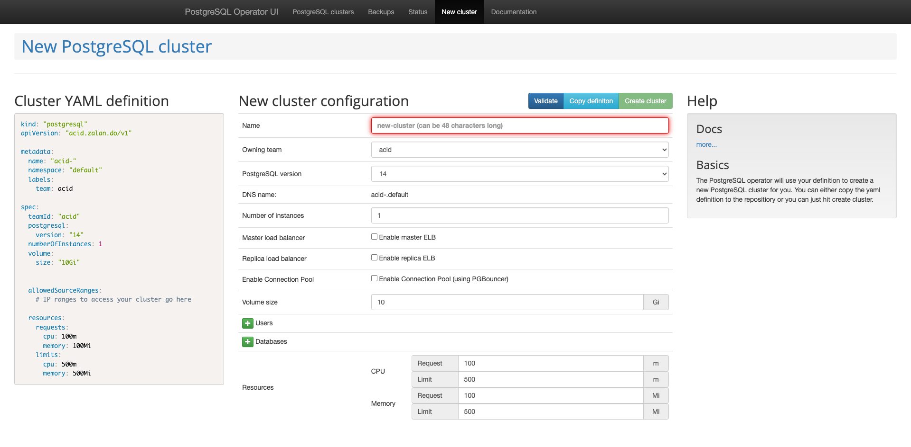
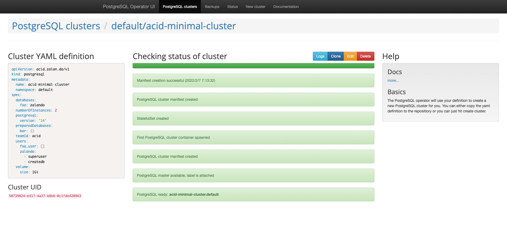

# Postgres Operator

Version: [v1.7.1](https://github.com/zalando/postgres-operator/releases/tag/v1.7.1)

## Overview


## Quickstart
https://github.com/zalando/postgres-operator/blob/master/docs/quickstart.md

### 1. Install Postgres Operator

Namespace: `default`

```
kubectl apply -k github.com/zalando/postgres-operator/manifests
```

or

```
helm install postgres-operator ./charts/postgres-operator
```

### 2. Deploy the Operator UI

1. Deploy

    ```
    kubectl apply -k github.com/zalando/postgres-operator/ui/manifests
    ```

    or

    ```
    helm install postgres-operator-ui ./charts/postgres-operator-ui
    ```

1. Check

    ```
    kubectl port-forward svc/postgres-operator-ui 8081:80
    ```

1. Open http://localhost:8081/

    
### 3. Create a Postgres Cluster

Create:
- PostgreSQL cluster: `acid-minimal-cluster`
- Secret for roles:
    - `foo-user.acid-minimal-cluster.credentials.postgresql.acid.zalan.do`
    - `postgres.acid-minimal-cluster.credentials.postgresql.acid.zalan.do`
    - `standby.acid-minimal-cluster.credentials.postgresql.acid.zalan.do`
    - `zalando.acid-minimal-cluster.credentials.postgresql.acid.zalan.do`

1. Apply

    ```
    kubectl create -f https://raw.githubusercontent.com/zalando/postgres-operator/master/manifests/minimal-postgres-manifest.yaml
    ```

    <details><summary>Roles and Databases initially created:</summary>

    yaml:

    ```yaml
      users:
        zalando:  # database owner
        - superuser
        - createdb
        foo_user: []  # role for application foo
      databases:
        foo: zalando  # dbname: owner
      preparedDatabases:
        bar: {}
    ```

    roles:

    ```
    \du
                                                         List of roles
        Role name    |                         Attributes                         |               Member of
    -----------------+------------------------------------------------------------+----------------------------------------
     admin           | Create DB, Cannot login                                    | {foo_user,zalando,bar_owner}
     bar_data_owner  | Cannot login                                               | {bar_data_writer,bar_data_reader}
     bar_data_reader | Cannot login                                               | {}
     bar_data_writer | Cannot login                                               | {bar_data_reader}
     bar_owner       | Cannot login                                               | {bar_writer,bar_data_owner,bar_reader}
     bar_reader      | Cannot login                                               | {}
     bar_writer      | Cannot login                                               | {bar_reader}
     foo_user        |                                                            | {}
     postgres        | Superuser, Create role, Create DB, Replication, Bypass RLS | {}
     robot_zmon      | Cannot login                                               | {}
     standby         | Replication                                                | {}
     zalando         | Superuser, Create DB                                       | {}
     zalandos        | Cannot login                                               | {}
    ```

    databases:

    ```
    \l
                                      List of databases
       Name    |   Owner   | Encoding |   Collate   |    Ctype    |   Access privileges
    -----------+-----------+----------+-------------+-------------+-----------------------
     bar       | bar_owner | UTF8     | en_US.utf-8 | en_US.utf-8 |
     foo       | zalando   | UTF8     | en_US.utf-8 | en_US.utf-8 |
     postgres  | postgres  | UTF8     | en_US.utf-8 | en_US.utf-8 |
     template0 | postgres  | UTF8     | en_US.utf-8 | en_US.utf-8 | =c/postgres          +
               |           |          |             |             | postgres=CTc/postgres
     template1 | postgres  | UTF8     | en_US.utf-8 | en_US.utf-8 | =c/postgres          +
               |           |          |             |             | postgres=CTc/postgres
    (5 rows)
    ```

    </details>

1. Check

    ```
    # check the deployed cluster
    kubectl get postgresql

    # check created database pods
    kubectl get pods -l application=spilo -L spilo-role

    # check created service resources
    kubectl get svc -l application=spilo -L spilo-role
    ```

1. Connect to Postgres cluster

    ```
    kubectl exec -it acid-minimal-cluster-0 -- psql -Upostgres
    psql (14.0 (Ubuntu 14.0-1.pgdg18.04+1))
    Type "help" for help.

    postgres=#
    ```

1. Check on UI

    http://localhost:8081/#/status/default/acid-minimal-cluster


    


### 4. Create a new user `john` and a new databas `test_db`.

1. Edit `postgresql` `acid-minimal-cluster` either on UI or in yaml.

1. `Secret` is created (`{username}.{team}-{clustername}.credentials.postgresql.acid.zalan.do`)

    ```
    kubectl get secret john.acid-minimal-cluster.credentials.postgresql.acid.zalan.do
    NAME                                                             TYPE     DATA   AGE
    john.acid-minimal-cluster.credentials.postgresql.acid.zalan.do   Opaque   2      2m49s
    ```

1. Log in with `john`:

    ```
    export PGMASTER=$(kubectl get pods -o jsonpath={.items..metadata.name} -l application=spilo,cluster-name=acid-minimal-cluster,spilo-role=master -n default)
    kubectl port-forward $PGMASTER 6432:5432 -n default
    ```

    ```
    export PGPASSWORD=$(kubectl get secret john.acid-minimal-cluster.credentials.postgresql.acid.zalan.do -o 'jsonpath={.data.password}' | base64 -d)
    export PGSSLMODE=require
    psql -U john -h localhost -p 6432 test_db
    psql (14.1, server 14.0 (Ubuntu 14.0-1.pgdg18.04+1))
    SSL connection (protocol: TLSv1.3, cipher: TLS_AES_256_GCM_SHA384, bits: 256, compression: off)
    Type "help" for help.

    test_db=>
    ```

### 4. Delete cluster

```
kubectl delete -f resources/minimal-postgres-manifest.yaml
```

### 5. Remove operator

```
kubectl apply -k github.com/zalando/postgres-operator/manifests
kubectl delete -k github.com/zalando/postgres-operator/ui/manifests # ui
```

## References
- https://postgres-operator.readthedocs.io/en/latest/
- https://recruit.gmo.jp/engineer/jisedai/blog/postgresql12-patroni-cluster/
- https://postgresconf.org/conferences/2021_Postgres_Conference_Webinars/program/proposals/creating-a-resilient-postgresql-cluster-with-kubegres
- https://www.youtube.com/watch?v=CftcVhFMGSY
- https://github.com/zalando/patroni
- https://github.com/zalando/postgres-operator
- https://github.com/zalando/spilo
