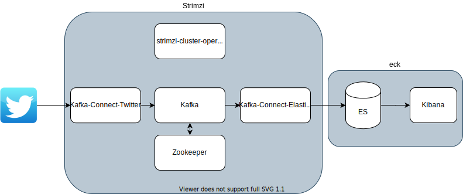
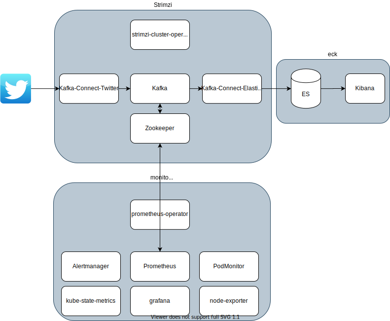
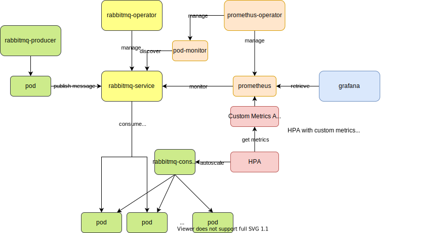

# 3.1 Kubernetes

## Practice 1: Install Elasticsearch, Kibana & Filebeat with Helm

1. Create namespace

    ```
    kubectl create namespace eck
    ```

1. Add elastic Helm

    ```
    helm repo add elastic https://helm.elastic.co
    ```

1. Install ES

    ```
    helm install -n eck elasticsearch elastic/elasticsearch -f helm/es-config.yaml
    ```

1. Install Kibana

    ```
    helm install -n eck kibana elastic/kibana -f helm/kb-config.yaml
    ```

1. Install filebeat

    ```
    helm install -n eck filebeat elastic/filebeat --version 7.8.1 -f helm/filebeat-config.yaml
    ```

## Practice 2: Install Kafka Cluster + Kafka Connect with Strimzi

- Kafka

    1. Update the kafka-connect-twitter with your own API token
    1. Apply Kafka

        ```
        kubectl create namespace kafka-strimzi-18
        kubectl apply -k strimzi/overlays/kafka-strimzi-18
        ```



<details>

```
NAMESPACE          NAME                                                             READY   STATUS    RESTARTS   AGE
eck                elasticsearch-master-0                                           1/1     Running   0          14h
eck                kibana-kibana-55f4bc96f5-7fz65                                   1/1     Running   0          14h
kafka-strimzi-18   kafka-connect-sink-connect-847cfbf66-gwtkl                       1/1     Running   0          7h27m
kafka-strimzi-18   kafka-connect-source-connect-57bf7974f7-sz8ww                    1/1     Running   0          7h27m
kafka-strimzi-18   my-cluster-entity-operator-579cdc77bc-v6rxt                      3/3     Running   5          14h
kafka-strimzi-18   my-cluster-kafka-0                                               2/2     Running   0          14h
kafka-strimzi-18   my-cluster-kafka-1                                               2/2     Running   0          14h
kafka-strimzi-18   my-cluster-kafka-2                                               2/2     Running   2          14h
kafka-strimzi-18   my-cluster-zookeeper-0                                           1/1     Running   0          14h
kafka-strimzi-18   strimzi-cluster-operator-6c9d899778-nkd9q                        1/1     Running   0          14h
kube-system        kube-dns-869d587df7-7whsm                                        3/3     Running   0          14h
kube-system        kube-dns-869d587df7-z659j                                        3/3     Running   0          14h
kube-system        kube-dns-autoscaler-645f7d66cf-r9ttj                             1/1     Running   0          14h
kube-system        kube-proxy-gke-my-gke-cluster-my-gke-cluster-nod-9dff1786-x4wz   1/1     Running   0          14h
kube-system        kube-proxy-gke-my-gke-cluster-my-gke-cluster-pre-19639e01-7jsz   1/1     Running   0          93s
kube-system        kube-proxy-gke-my-gke-cluster-my-gke-cluster-pre-19639e01-cnl2   1/1     Running   0          14h
kube-system        kube-proxy-gke-my-gke-cluster-my-gke-cluster-pre-19639e01-f6cb   1/1     Running   0          14h
kube-system        kube-proxy-gke-my-gke-cluster-my-gke-cluster-pre-19639e01-vw9d   1/1     Running   0          14h
kube-system        l7-default-backend-678889f899-fvswg                              1/1     Running   0          14h
kube-system        metrics-server-v0.3.6-7b7d6c7576-msl8x                           2/2     Running   0          14h
```

</details>

## Practice 3: Install Prometheus & Grafana with kube-prometheus

- Prometheus & Grafana

    ```
    git clone https://github.com/coreos/kube-prometheus.git && kube-prometheus
    ```

    ```
    kubectl apply -f manifests/setup
    ```

    wait a few minutes

    ```
    kubectl create -f manifests
    ```

- Add strimzi monitoring

    ```
    kubectl apply -f strimzi/monitoring/prometheus-prometheus.yaml,strimzi/monitoring/prometheus-clusterRole.yaml
    ```

- Add elasticsearch monitoring



<details>

```
kubectl get pod --all-namespaces
NAMESPACE          NAME                                                             READY   STATUS    RESTARTS   AGE
eck                elasticsearch-master-0                                           1/1     Running   0          3d3h
eck                kibana-kibana-55f4bc96f5-7fz65                                   1/1     Running   0          3d4h
kafka-strimzi-18   kafka-connect-sink-connect-75db959966-sxqxx                      1/1     Running   0          43m
kafka-strimzi-18   kafka-connect-source-connect-6bc6d8797c-rr2x2                    1/1     Running   0          42m
kafka-strimzi-18   my-cluster-entity-operator-579cdc77bc-v6rxt                      3/3     Running   0          3d4h
kafka-strimzi-18   my-cluster-kafka-0                                               2/2     Running   0          2d13h
kafka-strimzi-18   my-cluster-kafka-1                                               2/2     Running   0          2d13h
kafka-strimzi-18   my-cluster-kafka-2                                               2/2     Running   0          2d13h
kafka-strimzi-18   my-cluster-zookeeper-0                                           1/1     Running   50         2d1h
kafka-strimzi-18   my-cluster-zookeeper-1                                           1/1     Running   16         2d1h
kafka-strimzi-18   my-cluster-zookeeper-2                                           1/1     Running   0          2d1h
kafka-strimzi-18   strimzi-cluster-operator-6c9d899778-nkd9q                        1/1     Running   0          3d4h
kube-system        kube-dns-869d587df7-7whsm                                        3/3     Running   0          3d4h
kube-system        kube-dns-869d587df7-z659j                                        3/3     Running   0          3d4h
kube-system        kube-dns-autoscaler-645f7d66cf-r9ttj                             1/1     Running   0          3d4h
kube-system        kube-proxy-gke-my-gke-cluster-my-gke-cluster-nod-9dff1786-x4wz   1/1     Running   0          3d4h
kube-system        kube-proxy-gke-my-gke-cluster-my-gke-cluster-pre-19639e01-7jsz   1/1     Running   0          2d13h
kube-system        kube-proxy-gke-my-gke-cluster-my-gke-cluster-pre-19639e01-cnl2   1/1     Running   0          3d4h
kube-system        kube-proxy-gke-my-gke-cluster-my-gke-cluster-pre-19639e01-f6cb   1/1     Running   0          3d4h
kube-system        kube-proxy-gke-my-gke-cluster-my-gke-cluster-pre-19639e01-vw9d   1/1     Running   0          3d4h
kube-system        l7-default-backend-678889f899-fvswg                              1/1     Running   0          3d4h
kube-system        metrics-server-v0.3.6-7b7d6c7576-msl8x                           2/2     Running   0          3d4h
monitoring         alertmanager-main-0                                              2/2     Running   0          13h
monitoring         alertmanager-main-1                                              2/2     Running   0          13h
monitoring         alertmanager-main-2                                              2/2     Running   0          13h
monitoring         grafana-58dc7468d7-vnsbh                                         1/1     Running   0          13h
monitoring         kube-state-metrics-765c7c7f95-fhkls                              3/3     Running   0          13h
monitoring         node-exporter-bjq6x                                              2/2     Running   0          13h
monitoring         node-exporter-d7dx8                                              2/2     Running   0          13h
monitoring         node-exporter-ddmxd                                              2/2     Running   0          13h
monitoring         node-exporter-mj6tx                                              2/2     Running   0          13h
monitoring         node-exporter-psf45                                              2/2     Running   0          13h
monitoring         prometheus-adapter-5cd5798d96-fkd75                              1/1     Running   0          13h
monitoring         prometheus-k8s-0                                                 3/3     Running   1          12h
monitoring         prometheus-k8s-1                                                 3/3     Running   1          12h
monitoring         prometheus-operator-5f75d76f9f-xtgqz                             1/1     Running   0          2d5h
```

</details>

## Practice 4: Kafka exporter & MirrorMaker2


1. Enable the cluster operator to watch the other namespace


    ```diff
    +  - strimzi-0.18.0/install/cluster-operator/050-Deployment-strimzi-cluster-operator.yaml
    ```

    ```
    kubectl apply -k strimzi/overlays/kafka-strimzi-18
    ```

1. Deploy new `Kafka` cluster and `KafkaMirrorMaker2` in the other namespace `kafka-strimzi-18-staging`

    ```
    kubectl apply -k strimzi/overlays/kafka-strimzi-18-staging
    ```

1. Clean up

    ```
    kubectl delete -k strimzi/overlays/kafka-strimzi-18-staging
    ```


## Practice 5: Horizontal Pod Autoscaler (HPA) (basic)

1. Install metrics-server

    ```
    kubectl apply -f https://github.com/kubernetes-sigs/metrics-server/releases/latest/download/components.yaml
    ```

1. Apply an apache application

    ```
    kubectl apply -f https://k8s.io/examples/application/php-apache.yaml
    ```

1. Set autoscale by kubectl

    ```
    kubectl autoscale deployment php-apache --cpu-percent=50 --min=1 --max=10
    ```

1. Increase load -> confirm HPA is working

    ```
    kubectl run -i --tty load-generator --rm --image=busybox --restart=Never -- /bin/sh -c "while sleep 0.01; do wget -q -O- http://php-apache; done"
    ```

    ```
    kubectl get hpa

    NAME         REFERENCE               TARGETS   MINPODS   MAXPODS   REPLICAS   AGE
    php-apache   Deployment/php-apache   76%/50%   1         10        7          4m10s
    ```

## Practice 6: HPA with custom metrics (advanced)

[autoscaler/hpa/custom-metrics]()

Steps:

1. Prometheus Operator:

    ```
    kubectl apply -f https://raw.githubusercontent.com/prometheus-operator/prometheus-operator/master/bundle.yaml
    ```

1. Prometheus:

    ```
    kubectl create ns monitoring; kubectl apply -k prometheus-operator -n monitoring
    ```
1. RabbitMQ Operator:

    ```
    kubectl apply -f https://github.com/rabbitmq/cluster-operator/releases/latest/download/cluster-operator.yml
    ````
1. RabbitMQ:

    ```
    kubectl apply -f autoscaler/hpa/custom-metrics/rabbitmq/rabbitmq-cluster.yaml
    kubectl apply -f autoscaler/hpa/custom-metrics/rabbitmq/pod-monitor-rabbitmq.yaml
    ```
1. RabbitMQ producer:

    ```
    kubectl apply -f autoscaler/hpa/custom-metrics/rabbitmq-producer-cronjob.yaml
    ```
1. RabbitMQ consumer:

    ```
    kubectl apply -f autoscaler/hpa/custom-metrics/rabbitmq-consumer-deployment.yaml
    ```
1. Prometheus-Adapter: Extend the Kubernetes custom metrics API with the metrics. (https://github.com/kubernetes-sigs/prometheus-adapter)

    ```
    cd autoscaler/hpa/custom-metrics/k8s-prom-hpa
    touch metrics-ca.key metrics-ca.crt metrics-ca-config.json
    make certs
    cd -
    kubectl create -f autoscaler/hpa/custom-metrics/k8s-prom-hpa/custom-metrics-api
    ```
1. Apply HPA
    ```
    kubectl apply -f autoscaler/hpa/custom-metrics/rabbitmq-consumer-hpa.yaml
    ```



## Practice 7: Set up Kubernetes Cluster with kubeadm (local)

## Prerequisite

- OS X
- Virtualbox
    - https://www.virtualbox.org/wiki/Downloads
- Vagrant
    - https://www.vagrantup.com/downloads

## References

- https://github.com/kodekloudhub/certified-kubernetes-administrator-course
- https://kubernetes.io/docs/setup/production-environment/tools/kubeadm/install-kubeadm/


## Steps

1. Clone repo

    ```
    git clone git@github.com:kodekloudhub/certified-kubernetes-administrator-course.git
    ```

1. Prepare vagrant

    1. Confirm everything is `not created`

        ```
        vagrant status
        Current machine states:

        kubemaster                not created (virtualbox)
        kubenode01                not created (virtualbox)
        kubenode02                not created (virtualbox)

        This environment represents multiple VMs. The VMs are all listed
        above with their current state. For more information about a specific
        VM, run `vagrant status NAME`.
        ```

    1. `vagrant up`

        If you have a problem of virtualbox, you need to allow `Oracle` in `Preferences > Security & Privacy` https://qiita.com/akane_kato/items/c103332729e3d0ac39e6.

    1. Check

        Login to master

        ```
        vagrant status
        vagrant ssh kubemaster
        ```

1. Set up all nodes

    run the following commands in all nodes

    1. Bridge network

        ```
        sudo modprobe br_netfilter
        ```

        ```
        cat <<EOF | sudo tee /etc/modules-load.d/k8s.conf
        br_netfilter
        EOF

        cat <<EOF | sudo tee /etc/sysctl.d/k8s.conf
        net.bridge.bridge-nf-call-ip6tables = 1
        net.bridge.bridge-nf-call-iptables = 1
        EOF
        sudo sysctl --system
        ```

    1. Install container runtime (Docker)

        https://kubernetes.io/docs/setup/production-environment/container-runtimes/#docker

        ```
        sudo apt-get update && sudo apt-get install -y \
        apt-transport-https ca-certificates curl software-properties-common gnupg2
        curl -fsSL https://download.docker.com/linux/ubuntu/gpg | sudo apt-key --keyring /etc/apt/trusted.gpg.d/docker.gpg add -
        sudo add-apt-repository \
        "deb [arch=amd64] https://download.docker.com/linux/ubuntu \
        $(lsb_release -cs) \
        stable"
        ```

        ```
        sudo apt-get update && sudo apt-get install -y \
        containerd.io=1.2.13-2 \
        docker-ce=5:19.03.11~3-0~ubuntu-$(lsb_release -cs) \
        docker-ce-cli=5:19.03.11~3-0~ubuntu-$(lsb_release -cs)
        sudo mkdir /etc/docker
        ```

        ```
        cat <<EOF | sudo tee /etc/docker/daemon.json
        {
        "exec-opts": ["native.cgroupdriver=systemd"],
        "log-driver": "json-file",
        "log-opts": {
            "max-size": "100m"
        },
        "storage-driver": "overlay2"
        }
        EOF
        sudo mkdir -p /etc/systemd/system/docker.service.d
        ```

        ```
        sudo systemctl daemon-reload
        sudo systemctl restart docker
        ```

    1. Install kubeadm, kubelet, and kubectl

        https://kubernetes.io/docs/setup/production-environment/tools/kubeadm/install-kubeadm/#installing-kubeadm-kubelet-and-kubectl


        ```
        sudo apt-get update && sudo apt-get install -y apt-transport-https curl
        curl -s https://packages.cloud.google.com/apt/doc/apt-key.gpg | sudo apt-key add -
        cat <<EOF | sudo tee /etc/apt/sources.list.d/kubernetes.list
        deb https://apt.kubernetes.io/ kubernetes-xenial main
        EOF
        sudo apt-get update
        sudo apt-get install -y kubelet kubeadm kubectl
        sudo apt-mark hold kubelet kubeadm kubectl
        ```

1. Create a cluster with kubeadm (on master node)

    https://kubernetes.io/docs/setup/production-environment/tools/kubeadm/create-cluster-kubeadm/

    1. Get the ip address of master node

        ```
        vagrant@kubemaster:~$ ifconfig enp0s8
        enp0s8: flags=4163<UP,BROADCAST,RUNNING,MULTICAST>  mtu 1500
                inet 192.168.56.2  netmask 255.255.255.0  broadcast 192.168.56.255
                inet6 fe80::a00:27ff:fe6e:f8b9  prefixlen 64  scopeid 0x20<link>
                ether 08:00:27:6e:f8:b9  txqueuelen 1000  (Ethernet)
                RX packets 1  bytes 86 (86.0 B)
                RX errors 0  dropped 0  overruns 0  frame 0
                TX packets 18  bytes 1356 (1.3 KB)
                TX errors 0  dropped 0 overruns 0  carrier 0  collisions 0
        ```

    1. `kubeadm init`

        ```
        sudo -i
        kubeadm init --pod-network-cidr 10.244.0.0/16 --apiserver-advertise-address=192.168.56.2
        ```

        <details>

        ```
        [init] Using Kubernetes version: v1.20.4
        [preflight] Running pre-flight checks
        [preflight] Pulling images required for setting up a Kubernetes cluster
        [preflight] This might take a minute or two, depending on the speed of your internet connection
        [preflight] You can also perform this action in beforehand using 'kubeadm config images pull'
        [certs] Using certificateDir folder "/etc/kubernetes/pki"
        [certs] Generating "ca" certificate and key
        [certs] Generating "apiserver" certificate and key
        [certs] apiserver serving cert is signed for DNS names [kubemaster kubernetes kubernetes.default kubernetes.default.svc kubernetes.default.svc.cluster.local] and IPs [10.96.0.1 192.168.56.2]
        [certs] Generating "apiserver-kubelet-client" certificate and key
        [certs] Generating "front-proxy-ca" certificate and key
        [certs] Generating "front-proxy-client" certificate and key
        [certs] Generating "etcd/ca" certificate and key
        [certs] Generating "etcd/server" certificate and key
        [certs] etcd/server serving cert is signed for DNS names [kubemaster localhost] and IPs [192.168.56.2 127.0.0.1 ::1]
        [certs] Generating "etcd/peer" certificate and key
        [certs] etcd/peer serving cert is signed for DNS names [kubemaster localhost] and IPs [192.168.56.2 127.0.0.1 ::1]
        [certs] Generating "etcd/healthcheck-client" certificate and key
        [certs] Generating "apiserver-etcd-client" certificate and key
        [certs] Generating "sa" key and public key
        [kubeconfig] Using kubeconfig folder "/etc/kubernetes"
        [kubeconfig] Writing "admin.conf" kubeconfig file
        [kubeconfig] Writing "kubelet.conf" kubeconfig file
        [kubeconfig] Writing "controller-manager.conf" kubeconfig file
        [kubeconfig] Writing "scheduler.conf" kubeconfig file
        [kubelet-start] Writing kubelet environment file with flags to file "/var/lib/kubelet/kubeadm-flags.env"
        [kubelet-start] Writing kubelet configuration to file "/var/lib/kubelet/config.yaml"
        [kubelet-start] Starting the kubelet
        [control-plane] Using manifest folder "/etc/kubernetes/manifests"
        [control-plane] Creating static Pod manifest for "kube-apiserver"
        [control-plane] Creating static Pod manifest for "kube-controller-manager"
        [control-plane] Creating static Pod manifest for "kube-scheduler"
        [etcd] Creating static Pod manifest for local etcd in "/etc/kubernetes/manifests"
        [wait-control-plane] Waiting for the kubelet to boot up the control plane as static Pods from directory "/etc/kubernetes/manifests". This can take up to 4m0s
        [kubelet-check] Initial timeout of 40s passed.
        [apiclient] All control plane components are healthy after 84.502944 seconds
        [upload-config] Storing the configuration used in ConfigMap "kubeadm-config" in the "kube-system" Namespace
        [kubelet] Creating a ConfigMap "kubelet-config-1.20" in namespace kube-system with the configuration for the kubelets in the cluster
        [upload-certs] Skipping phase. Please see --upload-certs
        [mark-control-plane] Marking the node kubemaster as control-plane by adding the labels "node-role.kubernetes.io/master=''" and "node-role.kubernetes.io/control-plane='' (deprecated)"
        [mark-control-plane] Marking the node kubemaster as control-plane by adding the taints [node-role.kubernetes.io/master:NoSchedule]
        [bootstrap-token] Using token: 5cptpm.66n574gszk32ginj
        [bootstrap-token] Configuring bootstrap tokens, cluster-info ConfigMap, RBAC Roles
        [bootstrap-token] configured RBAC rules to allow Node Bootstrap tokens to get nodes
        [bootstrap-token] configured RBAC rules to allow Node Bootstrap tokens to post CSRs in order for nodes to get long term certificate credentials
        [bootstrap-token] configured RBAC rules to allow the csrapprover controller automatically approve CSRs from a Node Bootstrap Token
        [bootstrap-token] configured RBAC rules to allow certificate rotation for all node client certificates in the cluster
        [bootstrap-token] Creating the "cluster-info" ConfigMap in the "kube-public" namespace
        [kubelet-finalize] Updating "/etc/kubernetes/kubelet.conf" to point to a rotatable kubelet client certificate and key
        [addons] Applied essential addon: CoreDNS
        [addons] Applied essential addon: kube-proxy

        Your Kubernetes control-plane has initialized successfully!

        To start using your cluster, you need to run the following as a regular user:

        mkdir -p $HOME/.kube
        sudo cp -i /etc/kubernetes/admin.conf $HOME/.kube/config
        sudo chown $(id -u):$(id -g) $HOME/.kube/config

        Alternatively, if you are the root user, you can run:

        export KUBECONFIG=/etc/kubernetes/admin.conf

        You should now deploy a pod network to the cluster.
        Run "kubectl apply -f [podnetwork].yaml" with one of the options listed at:
        https://kubernetes.io/docs/concepts/cluster-administration/addons/

        Then you can join any number of worker nodes by running the following on each as root:

        kubeadm join 192.168.56.2:6443 --token 5cptpm.66n574gszk32ginj \
            --discovery-token-ca-cert-hash sha256:f202b95d32fdfcad22a7b83b2a040b7b7451a0b92c8b96cdb14a47d3cea1dd31
        ```

        </details>

    1. Prepare kubeconfig

        ```
        logout
        mkdir -p $HOME/.kube
        sudo cp -i /etc/kubernetes/admin.conf $HOME/.kube/config
        sudo chown $(id -u):$(id -g) $HOME/.kube/config
        ```

        check

        ```
        kubectl get nodes
        NAME         STATUS     ROLES                  AGE   VERSION
        kubemaster   NotReady   control-plane,master   79m   v1.20.4
        ```

    1. Deploy a pod network (weave-net)

        https://kubernetes.io/docs/setup/production-environment/tools/kubeadm/create-cluster-kubeadm/#pod-network

        `weave-net`: https://www.weave.works/docs/net/latest/kubernetes/kube-addon/#install

        ```
        kubectl apply -f "https://cloud.weave.works/k8s/net?k8s-version=$(kubectl version | base64 | tr -d '\n')"
        ```

        Check

        ```
        kubectl get node
        NAME         STATUS   ROLES                  AGE   VERSION
        kubemaster   Ready    control-plane,master   84m   v1.20.4
        ```


1. Let `node01` and `node02` join the cluster

    1. Login to `node01` and `node02`
    1. Become root user by `sudo -i`
    1. Join the cluster
        ```
        kubeadm join 192.168.56.2:6443 --token 5cptpm.66n574gszk32ginj \
            --discovery-token-ca-cert-hash sha256:f202b95d32fdfcad22a7b83b2a040b7b7451a0b92c8b96cdb14a47d3cea1dd31
        ```

        <details>

        ```
        root@kubenode01:~#         kubeadm join 192.168.56.2:6443 --token 5cptpm.66n574gszk32ginj \
        >             --discovery-token-ca-cert-hash sha256:f202b95d32fdfcad22a7b83b2a040b7b7451a0b92c8b96cdb14a47d3cea1dd31
        [preflight] Running pre-flight checks
        [preflight] Reading configuration from the cluster...
        [preflight] FYI: You can look at this config file with 'kubectl -n kube-system get cm kubeadm-config -o yaml'
        [kubelet-start] Writing kubelet configuration to file "/var/lib/kubelet/config.yaml"
        [kubelet-start] Writing kubelet environment file with flags to file "/var/lib/kubelet/kubeadm-flags.env"
        [kubelet-start] Starting the kubelet
        [kubelet-start] Waiting for the kubelet to perform the TLS Bootstrap...

        This node has joined the cluster:
        * Certificate signing request was sent to apiserver and a response was received.
        * The Kubelet was informed of the new secure connection details.

        Run 'kubectl get nodes' on the control-plane to see this node join the cluster.
        ```

        </details>

    1. Check on master node

        ```
        vagrant@kubemaster:~$ kubectl get node
        NAME         STATUS   ROLES                  AGE   VERSION
        kubemaster   Ready    control-plane,master   86m   v1.20.4
        kubenode01   Ready    <none>                 61s   v1.20.4
        kubenode02   Ready    <none>                 61s   v1.20.4
        ```

1. Confirm the cluster is working

    ```
    kubectl run nginx --image nginx
    pod/nginx created
    ```

    ```
    kubectl get po -o wide
    NAME    READY   STATUS    RESTARTS   AGE   IP          NODE         NOMINATED NODE   READINESS GATES
    nginx   1/1     Running   0          90s   10.36.0.1   kubenode02   <none>           <none>
    ```

    ```
    kubectl delete pod nginx
    pod "nginx" deleted
    ```

1. Clean up vagrant

    ```
    vagrant destroy
        kubenode02: Are you sure you want to destroy the 'kubenode02' VM? [y/N] y
    ==> kubenode02: Forcing shutdown of VM...
    ==> kubenode02: Destroying VM and associated drives...
        kubenode01: Are you sure you want to destroy the 'kubenode01' VM? [y/N] y
    ==> kubenode01: Forcing shutdown of VM...
    ==> kubenode01: Destroying VM and associated drives...
        kubemaster: Are you sure you want to destroy the 'kubemaster' VM? [y/N] y
    ==> kubemaster: Forcing shutdown of VM...
    ==> kubemaster: Destroying VM and associated drives...
    ```

    ```
    vagrant status
    Current machine states:

    kubemaster                not created (virtualbox)
    kubenode01                not created (virtualbox)
    kubenode02                not created (virtualbox)

    This environment represents multiple VMs. The VMs are all listed
    above with their current state. For more information about a specific
    VM, run `vagrant status NAME`.
    ```

## Practice 8: Set up Kubernetes Cluster on GCP (kubernetes-the-hard-way)

[https://github.com/kelseyhightower/kubernetes-the-hard-way](https://github.com/kelseyhightower/kubernetes-the-hard-way])
