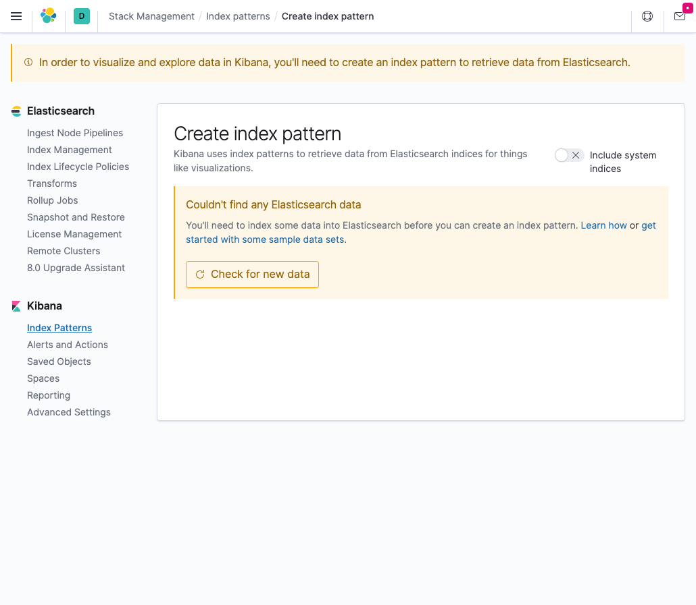

# Elastic Cloud on Kubernetes

- [k8s deploy eck](https://www.elastic.co/guide/en/cloud-on-k8s/current/k8s-deploy-eck.html)
- [deploy elasticsearch](https://www.elastic.co/guide/en/cloud-on-k8s/current/k8s-deploy-elasticsearch.html)
- [Resources](https://www.elastic.co/guide/en/cloud-on-k8s/current/k8s-managing-compute-resources.html)


## Install operator

```
kubectl apply -f https://download.elastic.co/downloads/eck/1.2.0/all-in-one.yaml
customresourcedefinition.apiextensions.k8s.io/apmservers.apm.k8s.elastic.co created
customresourcedefinition.apiextensions.k8s.io/beats.beat.k8s.elastic.co created
customresourcedefinition.apiextensions.k8s.io/elasticsearches.elasticsearch.k8s.elastic.co created
customresourcedefinition.apiextensions.k8s.io/enterprisesearches.enterprisesearch.k8s.elastic.co created
customresourcedefinition.apiextensions.k8s.io/kibanas.kibana.k8s.elastic.co created
namespace/elastic-system created
serviceaccount/elastic-operator created
secret/elastic-webhook-server-cert created
clusterrole.rbac.authorization.k8s.io/elastic-operator created
clusterrole.rbac.authorization.k8s.io/elastic-operator-view created
clusterrole.rbac.authorization.k8s.io/elastic-operator-edit created
clusterrolebinding.rbac.authorization.k8s.io/elastic-operator created
rolebinding.rbac.authorization.k8s.io/elastic-operator created
service/elastic-webhook-server created
statefulset.apps/elastic-operator created
validatingwebhookconfiguration.admissionregistration.k8s.io/elastic-webhook.k8s.elastic.co created
```

## Apply Elasticsearch

```
kubectl create ns eck;
kubectl apply -f eck/elasticsearch.yaml
```

Resource requires 2GB -> at least `e2-standard-2` in GKE

```
kubectl get pod -n eck
NAME                      READY   STATUS    RESTARTS   AGE
quickstart-es-default-0   1/1     Running   0          6m20s
```


Check connection

```
PASSWORD=$(kubectl get -n eck secret quickstart-es-elastic-user -o go-template='{{.data.elastic | base64decode}}'); echo $PASSWORD
```


```
kubectl -n eck port-forward service/quickstart-es-http 9200
```

```
curl -u "elastic:$PASSWORD" -k "https://localhost:9200"

{
  "name" : "quickstart-es-default-0",
  "cluster_name" : "quickstart",
  "cluster_uuid" : "S5blcUDgQ5u41eBA0TxMVA",
  "version" : {
    "number" : "7.8.1",
    "build_flavor" : "default",
    "build_type" : "docker",
    "build_hash" : "b5ca9c58fb664ca8bf9e4057fc229b3396bf3a89",
    "build_date" : "2020-07-21T16:40:44.668009Z",
    "build_snapshot" : false,
    "lucene_version" : "8.5.1",
    "minimum_wire_compatibility_version" : "6.8.0",
    "minimum_index_compatibility_version" : "6.0.0-beta1"
  },
  "tagline" : "You Know, for Search"
}
```

## kibana

```
kubectl apply -f eck/kibana.yaml
```

# Install with Helm

## Elasticsearch

https://github.com/elastic/helm-charts/tree/master/elasticsearch

```
helm repo add elastic https://helm.elastic.co
```

Install with customized values

```
helm show values elastic/elasticsearch > helm/es-config.yaml
helm install -n eck elasticsearch elastic/elasticsearch -f helm/es-config.yaml
```

Check connection

```
kubectl -n kafka-strimzi-18 exec -it $(kubectl get pod -n kafka-strimzi-18 | grep kafka-connect-sink | awk '{print $1}' | tail -1) -- curl -k "http://elasticsearch-master-headless.eck:9200"
{
  "name" : "elasticsearch-master-0",
  "cluster_name" : "elasticsearch",
  "cluster_uuid" : "2Ou_PUP4TCSUoMNHD_rnkA",
  "version" : {
    "number" : "7.8.1",
    "build_flavor" : "default",
    "build_type" : "docker",
    "build_hash" : "b5ca9c58fb664ca8bf9e4057fc229b3396bf3a89",
    "build_date" : "2020-07-21T16:40:44.668009Z",
    "build_snapshot" : false,
    "lucene_version" : "8.5.1",
    "minimum_wire_compatibility_version" : "6.8.0",
    "minimum_index_compatibility_version" : "6.0.0-beta1"
  },
  "tagline" : "You Know, for Search"
}
```

Upgrade

```
helm upgrade elasticsearch elastic/elasticsearch -n eck -f helm/es-config.yaml
```

## Kibana

https://github.com/elastic/helm-charts/tree/master/kibana

```
helm install kibana elastic/kibana
```

```
helm show values elastic/kibana > helm/kb-config.yaml
helm install -n eck kibana elastic/kibana -f helm/kb-config.yaml
```

```
kubectl -n eck port-forward service/kibana-kibana 5601
```


