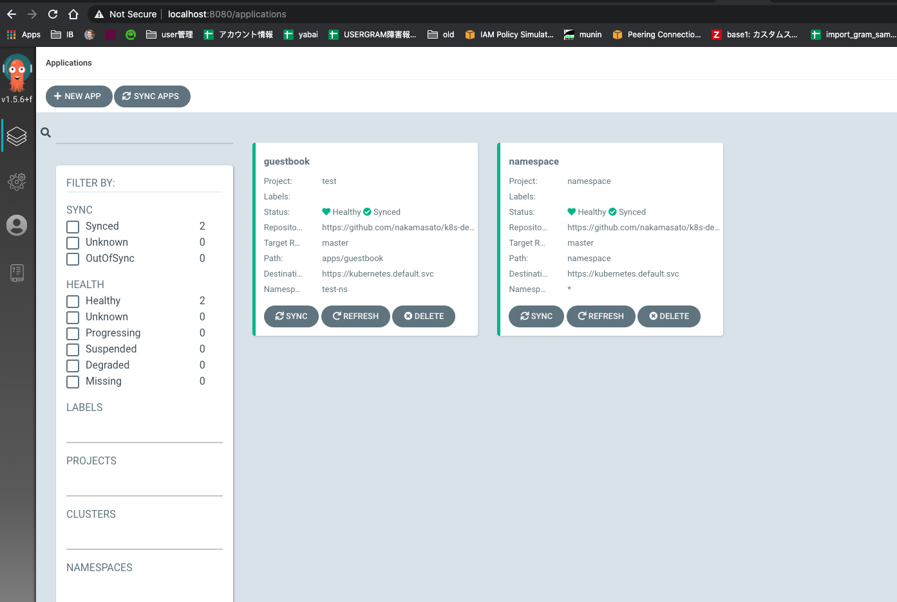

# Velero

- https://eksworkshop.com/intermediate/280_backup-and-restore/
- https://velero.io/docs/v1.4/

# Preparation

- [s3 bucket naka-kubernetes-backup](https://github.com/nakamasato/terraform/pull/205)
- [iam user, policy and policy attachment](https://github.com/nakamasato/terraform/pull/206)


```
aws iam create-access-key --user-name velero > velero-access-key.json
```

```
export VELERO_ACCESS_KEY_ID=$(cat velero-access-key.json | jq -r '.AccessKey.AccessKeyId')
export VELERO_SECRET_ACCESS_KEY=$(cat velero-access-key.json | jq -r '.AccessKey.SecretAccessKey')
```

```
cat > velero-credentials <<EOF
[default]
aws_access_key_id=$VELERO_ACCESS_KEY_ID
aws_secret_access_key=$VELERO_SECRET_ACCESS_KEY
EOF
```

# Usage

## Install

Mac: https://velero.io/docs/master/basic-install/

```
brew install velero
```

```
velero version
Client:
        Version: v1.4.0
        Git commit: -
<error getting server version: the server could not find the requested resource (post serverstatusrequests.velero.io)>
```

```
VELERO_BUCKET=naka-kubernetes-backup
AWS_REGION=ap-northeast-1
velero install \
    --provider aws \
    --plugins velero/velero-plugin-for-aws:v1.0.1 \
    --bucket $VELERO_BUCKET \
    --backup-location-config region=$AWS_REGION \
    --snapshot-location-config region=$AWS_REGION \
    --secret-file ./velero-credentials
CustomResourceDefinition/backups.velero.io: attempting to create resource
CustomResourceDefinition/backups.velero.io: created
CustomResourceDefinition/backupstoragelocations.velero.io: attempting to create resource
CustomResourceDefinition/backupstoragelocations.velero.io: created
CustomResourceDefinition/deletebackuprequests.velero.io: attempting to create resource
CustomResourceDefinition/deletebackuprequests.velero.io: created
CustomResourceDefinition/downloadrequests.velero.io: attempting to create resource
CustomResourceDefinition/downloadrequests.velero.io: created
CustomResourceDefinition/podvolumebackups.velero.io: attempting to create resource
CustomResourceDefinition/podvolumebackups.velero.io: created
CustomResourceDefinition/podvolumerestores.velero.io: attempting to create resource
CustomResourceDefinition/podvolumerestores.velero.io: created
CustomResourceDefinition/resticrepositories.velero.io: attempting to create resource
CustomResourceDefinition/resticrepositories.velero.io: created
CustomResourceDefinition/restores.velero.io: attempting to create resource
CustomResourceDefinition/restores.velero.io: created
CustomResourceDefinition/schedules.velero.io: attempting to create resource
CustomResourceDefinition/schedules.velero.io: created
CustomResourceDefinition/serverstatusrequests.velero.io: attempting to create resource
CustomResourceDefinition/serverstatusrequests.velero.io: created
CustomResourceDefinition/volumesnapshotlocations.velero.io: attempting to create resource
CustomResourceDefinition/volumesnapshotlocations.velero.io: created
Waiting for resources to be ready in cluster...
Namespace/velero: attempting to create resource
Namespace/velero: created
ClusterRoleBinding/velero: attempting to create resource
ClusterRoleBinding/velero: created
ServiceAccount/velero: attempting to create resource
ServiceAccount/velero: created
Secret/cloud-credentials: attempting to create resource
Secret/cloud-credentials: created
BackupStorageLocation/default: attempting to create resource
BackupStorageLocation/default: created
VolumeSnapshotLocation/default: attempting to create resource
VolumeSnapshotLocation/default: created
Deployment/velero: attempting to create resource
Deployment/velero: created
Velero is installed! ⛵ Use 'kubectl logs deployment/velero -n velero' to view the status.
```

Check resources on kuberentes

```
kubectl get all -n velero

NAME                          READY   STATUS    RESTARTS   AGE
pod/velero-5b596f6b56-4kvhx   1/1     Running   0          43s


NAME                     READY   UP-TO-DATE   AVAILABLE   AGE
deployment.apps/velero   1/1     1            1           44s

NAME                                DESIRED   CURRENT   READY   AGE
replicaset.apps/velero-5b596f6b56   1         1         1       44s
```

## backup

`test-ns` as an example in `k8s-deploy-test` repos

```
kubectl get all -n test-ns

NAME                                READY   STATUS    RESTARTS   AGE
pod/guestbook-ui-8569df798c-plf7b   1/1     Running   0          86m
pod/guestbook-ui-8569df798c-rc4fb   1/1     Running   0          86m
pod/guestbook-ui-8569df798c-twgq7   1/1     Running   0          86m


NAME                   TYPE        CLUSTER-IP      EXTERNAL-IP   PORT(S)   AGE
service/guestbook-ui   ClusterIP   10.100.89.118   <none>        80/TCP    176m


NAME                           READY   UP-TO-DATE   AVAILABLE   AGE
deployment.apps/guestbook-ui   3/3     3            3           176m

NAME                                      DESIRED   CURRENT   READY   AGE
replicaset.apps/guestbook-ui-8569df798c   3         3         3       176m
```

Backup

```
velero backup create test-ns-backup --include-namespaces test-ns
Backup request "test-ns-backup" submitted successfully.
Run `velero backup describe test-ns-backup` or `velero backup logs test-ns-backup` for more details.
```

Check

```
velero backup describe test-ns-backup
Name:         test-ns-backup
Namespace:    velero
Labels:       velero.io/storage-location=default
Annotations:  velero.io/source-cluster-k8s-gitversion=v1.15.11-eks-af3caf
              velero.io/source-cluster-k8s-major-version=1
              velero.io/source-cluster-k8s-minor-version=15+

Phase:  Completed

Namespaces:
  Included:  test-ns
  Excluded:  <none>

Resources:
  Included:        *
  Excluded:        <none>
  Cluster-scoped:  auto

Label selector:  <none>

Storage Location:  default

Velero-Native Snapshot PVs:  auto

TTL:  720h0m0s

Hooks:  <none>

Backup Format Version:  1

Started:    2020-06-07 15:38:49 +0900 JST
Completed:  2020-06-07 15:38:50 +0900 JST

Expiration:  2020-07-07 15:38:49 +0900 JST

Total items to be backed up:  32
Items backed up:              32

Velero-Native Snapshots: <none included>
```

## Delete all the resources

```
kubectl delete namespace test-ns
```

## Restore

```
velero restore create --from-backup test-ns-backup
Restore request "test-ns-backup-20200607154244" submitted successfully.
Run `velero restore describe test-ns-backup-20200607154244` or `velero restore logs test-ns-backup-20200607154244` for more details.
```

```
velero restore get

NAME                            BACKUP           STATUS      WARNINGS   ERRORS   CREATED                         SELECTOR
test-ns-backup-20200607154244   test-ns-backup   Completed   0          0        2020-06-07 15:42:45 +0900 JST   <none>
```

# Example (Argocd namespace)

1. Resources to back up

    

1. Back up
    ```
    velero backup create argocd-backup --include-namespaces argocd
    Backup request "argocd-backup" submitted successfully.
    Run `velero backup describe argocd-backup` or `velero backup logs argocd-backup` for more details.
    ```

1. Delete `argocd` namespace

    ```
    kubectl delete namespace argocd
    namespace "argocd" deleted
    ```

    -> failed to delete completely

1. Restore

    ```
    velero restore create --from-backup argocd-backup
    Restore request "argocd-backup-20200607155736" submitted successfully.
    Run `velero restore describe argocd-backup-20200607155736` or `velero restore logs argocd-backup-20200607155736` for more details.
    ```

    Couldn't recover ...
