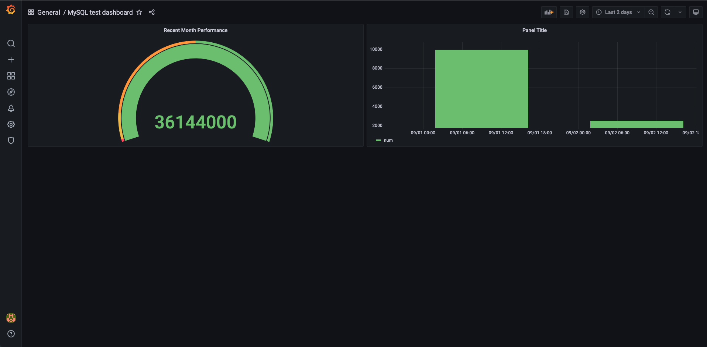

# Grafana

https://github.com/grafana/grafana
## Version

Latest

## Install

```
kubectl create ns monitoring
kubectl apply -k .
```

## Dashboards

Pre-configured dashboards are in `config/dashboards/dashboard.yaml`

- RabbitMQ: [config/dashboards/rabbitmq.json]()
- MySQL: [config/dashboards/mysql-test.json]()

## Data sources

Configured data sources are in `config/datasources/datasource.yaml`

### Prometheus

1. Apply Prometheus with prometheus-operator following [prometheus-operator](../prometheus-operator)
1. Data source is already set to `http://prometheus.monitoring.svc:9090` on Grafana.

### MySQL

1. Create mysql in `database` namespace
    ```
    kubectl create ns database
    kubectl apply -k datasources/mysql
    ```

1. The following data in `stat` table is initialized in entrypoint of MySQL.

    ```sql
    mysql> select * from stat;
    +-------+---------------------+---------------------+
    | num   | started_at          | updated_at          |
    +-------+---------------------+---------------------+
    | 10000 | 2021-09-01 00:00:00 | 2021-09-01 00:00:20 |
    | 10000 | 2021-09-01 00:00:20 | 2021-09-01 00:00:30 |
    |  5000 | 2021-09-02 00:00:00 | 2021-09-02 00:00:10 |
    |   100 | 2021-09-02 00:00:00 | 2021-09-02 00:00:20 |
    +-------+---------------------+---------------------+
    4 rows in set (0.00 sec)
    ```

1. Data source for MySQL is configured:
    - host: `mysql.default.svc.cluster.local`
    - user: `grafana`
    - password: `password`
1. Dashboard with MySQL data source.

    ```sql
    SELECT sum(num) / sum(TIME_TO_SEC(TIMEDIFF(updated_at, started_at))) * 86400 AS "num" FROM stat
    WHERE started_at > NOW() - INTERVAL 1 MONTH
    ```

    


## CleanUp

Delete MySQL for data source:

```
kubectl delete -k datasources/mysql
kubectl delete ns database
```

Delete Grafana:

```
kubectl delete -k .
kubectl delete ns monitoring
```

## Related

You may also like [Loki](../loki)
