# kube-controller-manager

## Controller Overview


- **Reflector**:
- **Delta FIFO queue**:
- [Informer](https://pkg.go.dev/k8s.io/client-go/informers): Monitor Object's event and EventHandler is called for each event (usually add item to WorkQueue in event handlers in a controller).
    - [sharedIndexInformer](https://github.com/kubernetes/client-go/blob/b425fb657986de75a11b1844886c70b486728935/tools/cache/shared_informer.go#L274-L286): Usually created for a specific resource (e.g. `deploymentInformer`) with `NewSharedIndexInformer`, which creates a new instance for the listwatcher.
        1. [Indexer](https://github.com/kubernetes/client-go/blob/b425fb657986de75a11b1844886c70b486728935/tools/cache/index.go#L35-L56): indexed local cache. Indexer extends [Store](https://github.com/kubernetes/client-go/blob/4ae0d1917adff2d93ea4c6a7ae3a9e5c19280b9f/tools/cache/store.go#L39) with multiple indices and restricts each accumulator to simply hold the current object.
        1. `Controller` that pulls objects/notifications using the ListerWatcher and pushes them into a `DeltaFIFO`.
        1. `sharedProcessor` responsible for relaying those notifications to each of the informer's clients. <- `EventHandler` is set to `processorListener`, which is stored in `listeners` of a `sharedProcessor`.
        1. `listerWatcher` for the target resource. e.g. for [deploymentInformer](https://github.com/kubernetes/client-go/blob/b425fb657986de75a11b1844886c70b486728935/informers/apps/v1/deployment.go#L60-L73)

            <details>

            ```go
    		&cache.ListWatch{
    			ListFunc: func(options metav1.ListOptions) (runtime.Object, error) {
    				if tweakListOptions != nil {
    					tweakListOptions(&options)
    				}
    				return client.AppsV1().Deployments(namespace).List(context.TODO(), options)
    			},
    			WatchFunc: func(options metav1.ListOptions) (watch.Interface, error) {
    				if tweakListOptions != nil {
    					tweakListOptions(&options)
    				}
    				return client.AppsV1().Deployments(namespace).Watch(context.TODO(), options)
    			},
    		},
            ```

            </details>

- **Lister**: Retrieve object from in-memory-cache.
- **WorkQueue**: Store item for which Reconcile loop is executed.
- **Scheme**: Scheme defines methods for serializing and deserializing API objects, a type registry for converting group, version, and kind information to and from Go schemas, and mappings between Go schemas of different versions. (ref: [scheme.go](https://github.com/kubernetes/apimachinery/blob/2936d3f03931b9c06a641799605d8e806cb2a58b/pkg/runtime/scheme.go#L31-L33))
- **processNextWorkItem**: Process an item in WorkQueue.
- **syncHandler**: Reconcile loop called by `processNextWorkItem` function (Function name can be different).

## EndpointsController



[[Kubernetes] EndpointsがよくわかってないのでEndpointsControllerを読んでみた](https://qiita.com/gymnstcs/items/13698c24af0a60f71bcd)

## DeploymentController


## References
- https://engineering.bitnami.com/articles/a-deep-dive-into-kubernetes-controllers.html
- https://engineering.bitnami.com/articles/kubewatch-an-example-of-kubernetes-custom-controller.html
- https://cloudnative.to/blog/client-go-informer-source-code/
- Start each controller: https://github.com/kubernetes/kubernetes/blob/fe099b2abdb023b21a17cd6a127e381b846c1a1f/cmd/kube-controller-manager/controller-manager.go
- Definition of each controller: https://github.com/kubernetes/kubernetes/tree/master/pkg/controller
