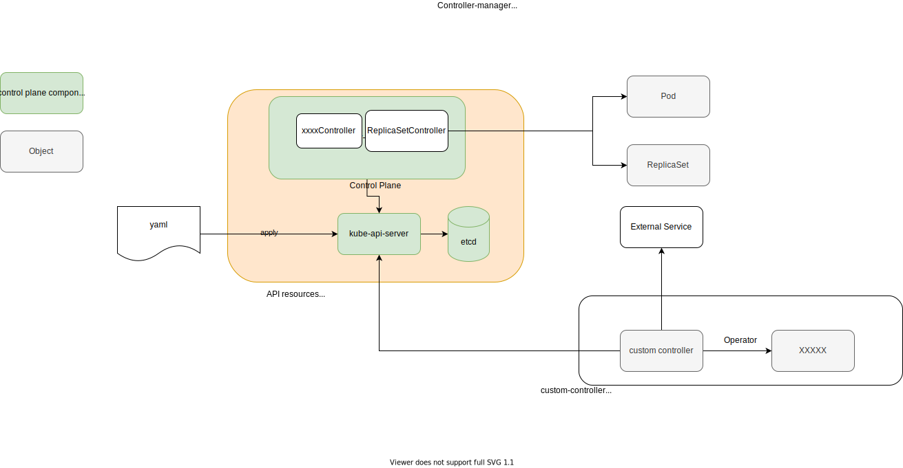

# Kubernetes Operator Study Journey
# 1. Use existing operators
- [prometheus-operator](../prometheus-operator)
- [postgres-operator](../postgres-operator)
- [strimzi](../strimzi)
- [rabbitmq-operator]
- [argocd](../argocd): [appcontroller.go](https://github.com/argoproj/argo-cd/blob/9025318adf367ae8f13b1a99e5c19344402b7bb9/controller/appcontroller.go)
# 2. Understand what is Kubernetes operator.



1. Kubernetes Controller components.
1. How Kubernetes Controlloer works.
1. Custom Resource.

**Kubernetes Operator**

> A Kubernetes operator is an application-specific controller that extends the functionality of the Kubernetes API to create, configure, and manage instances of complex applications on behalf of a Kubernetes user.

From https://www.redhat.com/en/topics/containers/what-is-a-kubernetes-operator

> Operators are software extensions to Kubernetes that make use of custom resources to manage applications and their components. Operators follow Kubernetes principles, notably the control loop.

From https://kubernetes.io/docs/concepts/extend-kubernetes/operator/
# 3. Create a sample operator following a tutorial

There are several ways to create an operator. You can try any of them.

- [sample-controller](https://github.com/kubernetes/sample-controller): https://github.com/nakamasato/foo-controller-kubebuilder
- [operator-sdk](https://sdk.operatorframework.io/)
    - [go-based](https://sdk.operatorframework.io/docs/building-operators/golang/quickstart/): https://github.com/nakamasato/memcached-operator
    - [helm-based](https://sdk.operatorframework.io/docs/building-operators/helm/quickstart/): https://github.com/nakamasato/nginx-operator
    - [ansible-based](https://sdk.operatorframework.io/docs/building-operators/ansible/quickstart/): https://github.com/nakamasato/memcached-operator-with-ansible
- [kubebuilder](https://book.kubebuilder.io/)
    - [Tutorial: Building CronJob](https://book.kubebuilder.io/cronjob-tutorial/cronjob-tutorial.html)
- [KUDO (Kubernetes Universal Declarative Operator)](https://kudo.dev/)
- [つくって学ぶKubebuilder](https://zoetrope.github.io/kubebuilder-training/)
# 4. Create your own operator

After creating a sample operator, you should have deeper understanding of controller. Now you can think about what kind of problem that you want to resolve by utilizing operator pattern.

To clarify a problem to resolve with a new operator, you can reference existing operators:

|operator|role|
|---|---|
|prometheus-operator|Manage Prometheus and configuration|


- [How can I have separate logic for Create, Update, and Delete events? When reconciling an object can I access its previous state?](https://sdk.operatorframework.io/docs/faqs/#how-can-i-have-separate-logic-for-create-update-and-delete-events-when-reconciling-an-object-can-i-access-its-previous-state) -> You should not have separate logic. Instead design your reconciler to be idempotent.
    - [Q: How do I have different logic in my reconciler for different types of events (e.g. create, update, delete)? in controller-runtime](https://github.com/kubernetes-sigs/controller-runtime/blob/master/FAQ.md#q-how-do-i-have-different-logic-in-my-reconciler-for-different-types-of-events-eg-create-update-delete)
- [Owners and Dependents](https://kubernetes.io/docs/concepts/overview/working-with-objects/owners-dependents/)

## Finalizer
## Reconcile Loop
- Based on the return value of Reconcile() the reconcile Request may be requeued and the loop may be triggered again: ([Building a Go-based Memcached Operator using the Operator SDK](https://docs.openshift.com/container-platform/4.1/applications/operator_sdk/osdk-getting-started.html#building-memcached-operator-using-osdk_osdk-getting-started))
    ```go
    // Reconcile successful - don't requeue
    return reconcile.Result{}, nil
    // Reconcile failed due to error - requeue
    return reconcile.Result{}, err
    // Requeue for any reason other than error
    return reconcile.Result{Requeue: true}, nil
    ```
- https://github.com/operator-framework/operator-sdk/issues/4209#issuecomment-729916367
## Testing:
- **KUbernetes Testing TooL (kuttl)**: https://kuttl.dev/ KUTTL is built to support some kubernetes integration test scenarios and is most valuable as an end-to-end (e2e) test harness.
- **Ginkgo** (A Golang BDD Testing Framework): https://onsi.github.io/ginkgo/
- **Gomega** (Ginkgo's preferred matcher library): https://onsi.github.io/gomega/
- **kubetest2**: https://github.com/kubernetes-sigs/kubetest2: Kubetest2 is the framework for launching and running end-to-end tests on Kubernetes. It is intended to be the next significant iteration of kubetest.
## Managing Errors:

https://cloud.redhat.com/blog/kubernetes-operators-best-practices
1. Return the error in the status of the object.
1. Generate an event describing the error.
# 5. Tools
- https://pkg.go.dev/sigs.k8s.io/controller-runtime/pkg/controller/controllerutil
- https://github.com/spf13/cobra: a library for creating powerful modern CLI applications & a program to generate applications and command files.
    - Cobra is used in many Go projects such as Kubernetes, Hugo, and Github CLI to name a few. This list contains a more extensive list of projects using Cobra.

# 6. Study Go lang for better codes

- [golang-standanrds/project-layout](https://github.com/golang-standards/project-layout)
- [Learn Go with tests](https://quii.gitbook.io/learn-go-with-tests/)

- [GoとDependency Injectionの現在](https://note.com/timakin/n/nc95d66a75b3d)
- [Go Blog](https://go.dev/blog)
