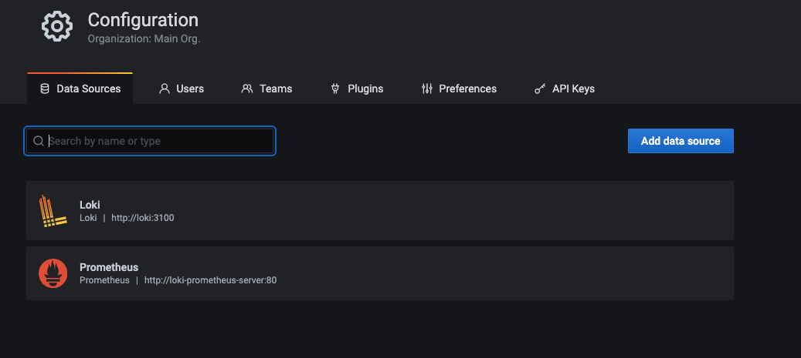
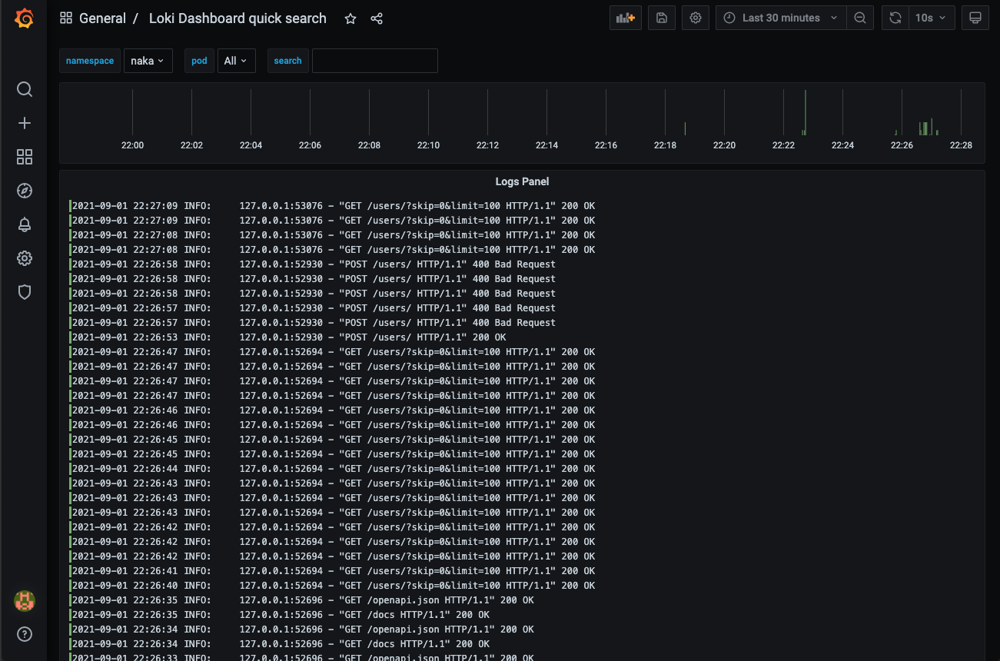
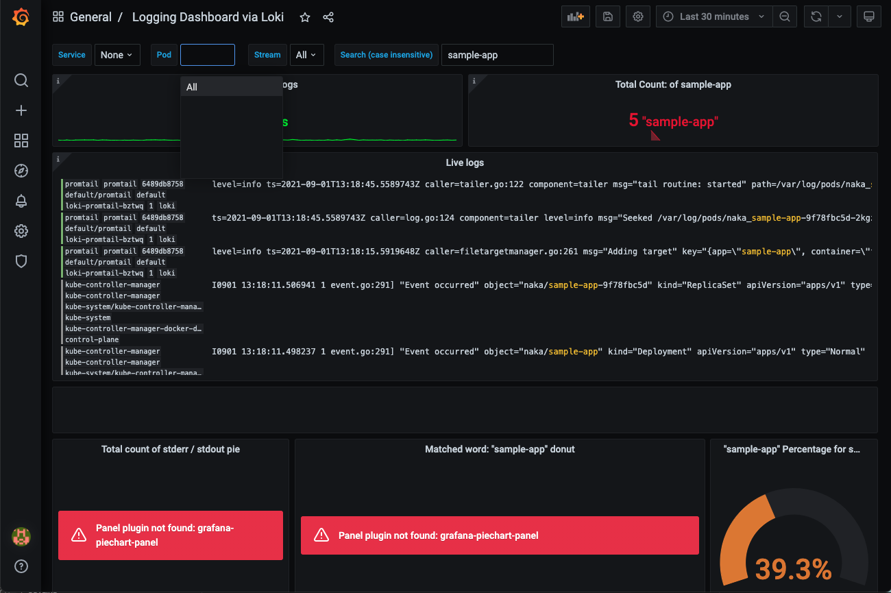
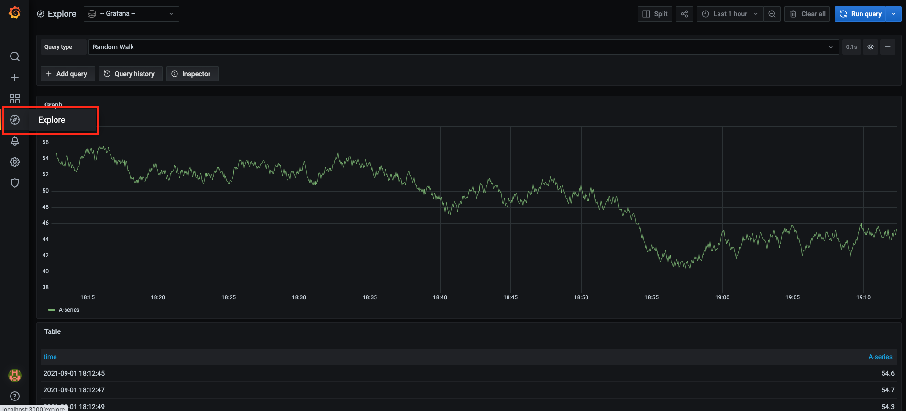
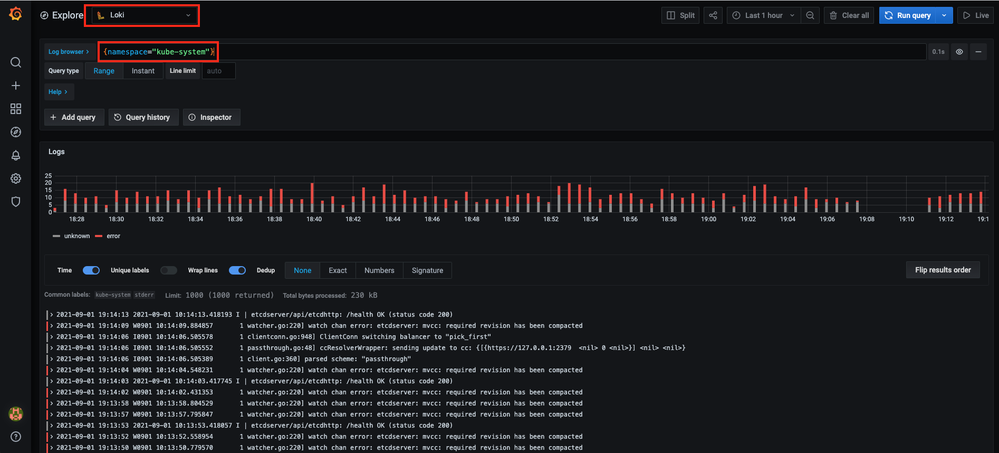
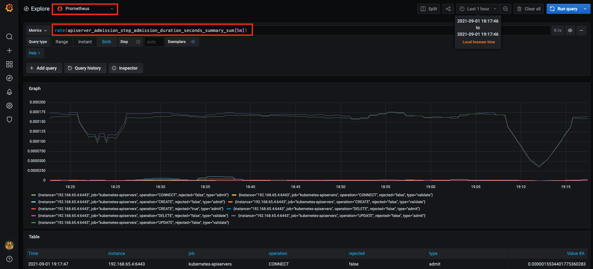

# Loki

## Prerequisite

- Kubernetes cluster
- Helm

## Install

https://grafana.com/docs/loki/latest/installation/helm/

Deploy Loki Stack (Loki, Promtail, Grafana, Prometheus) via Helm.

```
helm repo add grafana https://grafana.github.io/helm-charts
helm repo update
```

```
helm upgrade --install loki grafana/loki-stack  --set grafana.enabled=true,prometheus.enabled=true,prometheus.alertmanager.persistentVolume.enabled=false,prometheus.server.persistentVolume.enabled=false
```

<details><summary>Pods</summary>

```
kubectl get po
NAME                                           READY   STATUS    RESTARTS   AGE
loki-0                                         1/1     Running   0          98s
loki-grafana-7666b484b5-s6dkk                  1/1     Running   0          2m19s
loki-kube-state-metrics-7f9f667d7d-9wqgr       1/1     Running   0          2m19s
loki-prometheus-alertmanager-9bb4c6f8f-gc6jb   2/2     Running   0          2m19s
loki-prometheus-node-exporter-ngq8l            1/1     Running   0          2m19s
loki-prometheus-pushgateway-664fd45795-cffhg   1/1     Running   0          2m19s
loki-prometheus-server-5d6f9d5c6c-sn699        2/2     Running   0          2m19s
loki-promtail-bztwq                            1/1     Running   0          2m19s
```

</details>

## Promtail

Promtail is configured in a YAML file (usually referred to as config.yaml) which contains information on the Promtail server, where positions are stored, and how to scrape logs from files. (For more details: [Configuring Promtail](https://grafana.com/docs/loki/latest/clients/promtail/configuration/))


[Kubernetes Discovery](https://grafana.com/docs/loki/latest/clients/promtail/scraping/#kubernetes-discovery)

> Note that while Promtail can utilize the Kubernetes API to discover pods as targets, it can only read log files from pods that are running on the same node as the one Promtail is running on. Promtail looks for a __host__ label on each target and validates that it is set to the same hostname as Promtail’s (using either $HOSTNAME or the hostname reported by the kernel if the environment variable is not set).

Default `scrape_configs`:
- `kubernetes-pods-name`
- `kubernetes-pods-app`
- `kubernetes-pods-direct-controllers`
- `kubernetes-pods-indirect-controller`
- `kubernetes-pods-static`

## Grafana

### Connect to grafana

1. Port forward

    ```
    kubectl port-forward svc/loki-grafana 3000:80
    ```
1. Get the initial password for `admin`.

    ```
    kubectl get secret loki-grafana -o jsonpath="{.data.admin-password}" | base64 --decode ; echo
    ```
1. Open http://localhost:3000

### Data source for Loki on Grafana

https://grafana.com/docs/loki/latest/getting-started/grafana/

By default, data sources for `Loki` and `Prometheus` are set in http://localhost:3000/datasources.

<details>



</details>

## Dashboard
- https://grafana.com/grafana/dashboards/12611
- https://grafana.com/grafana/dashboards/12019

<details><summary>sample-app</summary>

1. Applied sample app in [Deploy Simple Application in Kubernetes](https://github.com/nakamasato/kubernetes-basics/tree/v2.0-rc/06-run-simple-application-in-kubernetes)
1. Check on `Loki Dashboard quick search`

    

    You can see `sample-app`'s logs in the dashboard, but you cannot see the logs if you choose the pod. (I don't know why.)

1. Check on `Logging Dashboard via Loki`

    

    - You cannot see `sample-app`'s log and Pod list.
    - Panel plugin is required to display piecharts.

</details>


### Explore

<details>





</details>

## Log CLI

https://grafana.com/docs/loki/latest/getting-started/logcli/

```
go get github.com/grafana/loki/cmd/logcli
```

## ToDo

- [ ] [How Istio, Tempo, and Loki speed up debugging for microservices](https://grafana.com/blog/2021/08/31/how-istio-tempo-and-loki-speed-up-debugging-for-microservices/?utm_source=grafana_news&utm_medium=rss)
