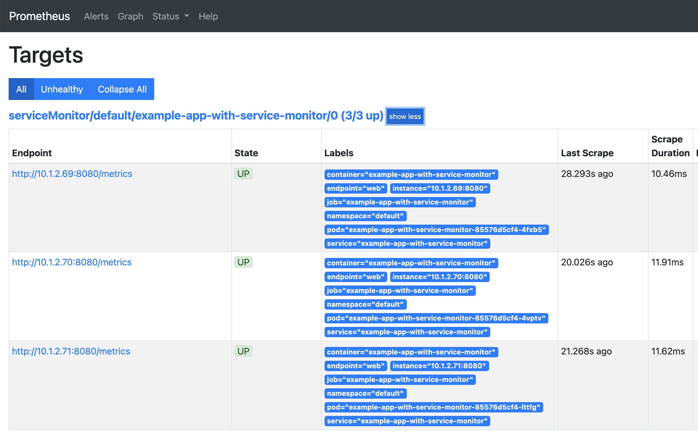
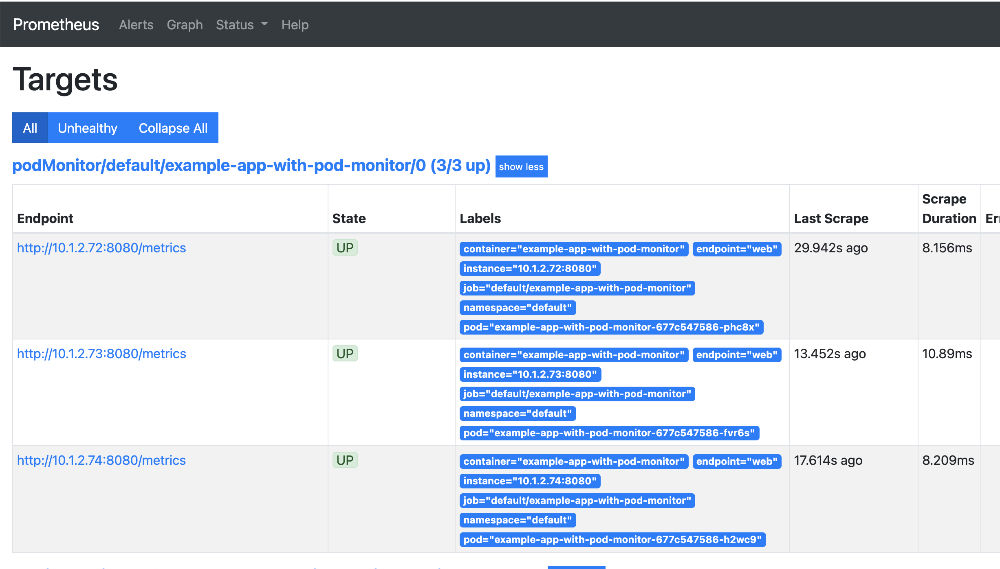

# Prometheus Operator

Official: [prometheus-operator](https://github.com/prometheus-operator/prometheus-operator/)

## Basic Usage

1. Create namespace

    ```
    kubectl create ns monitoring
    ```

1. Install Prometheus operator

    ```
    kubectl apply -f https://raw.githubusercontent.com/prometheus-operator/prometheus-operator/master/bundle.yaml -n monitoring
    ```

1. Deploy Prometheus

    ```
    kubectl apply -k .
    ```

1. Deploy example application with ServiceMonitor.

    ```
    kubectl apply -f example-app-with-service-monitor
    ```

    

1. Deploy example application with PodMonitor.
    ```
    kubectl apply -f example-app-with-pod-monitor
    ```

    

## Important Configurations

[PrometheusSpec](https://github.com/prometheus-operator/prometheus-operator/blob/master/Documentation/api.md#prometheusspec)

- `serviceMonitorNamespaceSelector`: Namespace's labels to match for ServiceMonitor discovery. If nil, only check own namespace. e.g. `serviceMonitorNamespaceSelector: {}` if you want to monitor all namespaces.
- `podMonitorNamespaceSelector`: Namespace's labels to match for PodMonitor discovery. If nil, only check own namespace. e.g. `podMonitorNamespaceSelector: {}` if you want to monitor all namespaces.
