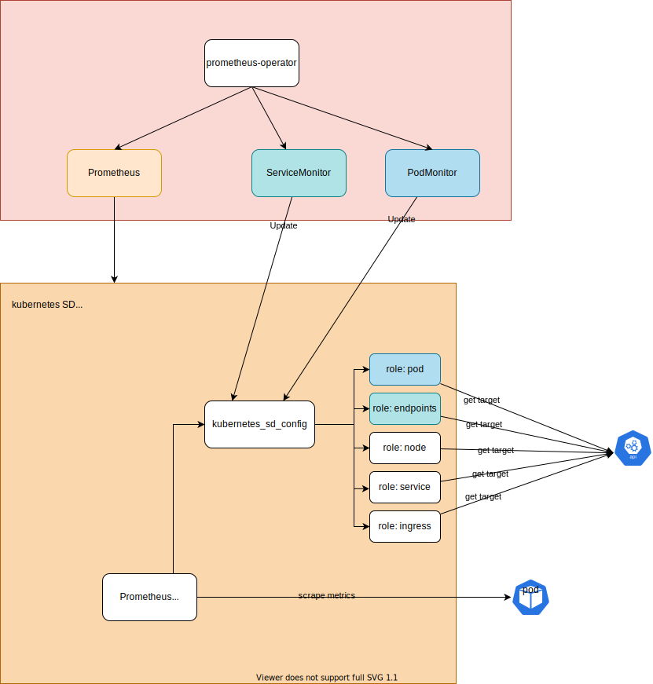
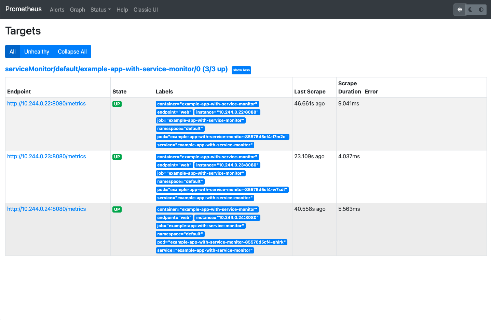
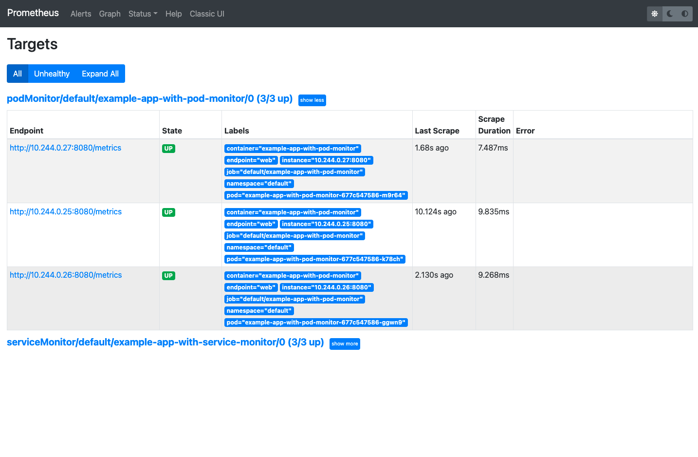

# Prometheus Operator

Official:
- [prometheus-operator](https://github.com/prometheus-operator/prometheus-operator/)
- [prometheus](https://github.com/prometheus/prometheus)

## Overview

### Prometheus Operator


### Prometheus


## Basic Usage

1. Create namespace.

    ```
    kubectl create ns monitoring
    ```

1. Install Prometheus operator in `default` namespace.

    ```
    kubectl create -f https://raw.githubusercontent.com/prometheus-operator/prometheus-operator/master/bundle.yaml
    ```

    <details><summary>This command creates the following resources:</summary>

    1. 8 CRDs:
        1. `AlertmanagerConfig`
        1. `Alertmanager`
        1. `PodMonitor`
        1. `Probe`
        1. `Prometheus`
        1. `PrometheusRule`
        1. `ServiceMonitor`
        1. `ThanosRuler`
    1. `ClusterRoleBinding` & `ClusterRole`: `prometheus-operator`
    1. `Deployment`: `prometheus-operator`
    1. `ServiceAccount`: `prometheus-operator`
    1. `Service`: `prometheus-operator`

    </details>

1. Deploy Prometheus in `monitoring` namespace.

    The resources to deploy:
    1. `Prometheus`
    1. rbac: `ClusterRole`, `ClusterRoleBinding`, and `ServiceAccount`
    1. `Service` for Prometheus Pods.
    1. `ServiceMonitor` for Prometheus itself.

    ```
    kubectl apply -k .
    ```

1. Deploy example application with `ServiceMonitor`.

    ```
    kubectl apply -f example-app-with-service-monitor
    ```

    ```
    kubectl port-forward -n monitoring svc/prometheus-operated 9090:9090
    ```

    Open http://localhost:9090/targets:

    

    We can see `serviceMonitor/default/example-app-with-service-monitor/0` in `scrape_configs`

    - `relabel_configs`: relabel based on the available Kubernetes metadata for [endpoints](https://prometheus.io/docs/prometheus/latest/configuration/configuration/#endpoints)
    - `kubernetes_sd_configs`: Kubernetes service discovery config. ServiceMonitor uses `endpoints` role.

        ```
        kubernetes_sd_configs:
        - role: endpoints
          kubeconfig_file: ""
          follow_redirects: true
          namespaces:
            names:
            - default
        ```

1. Deploy example application with `PodMonitor`.
    ```
    kubectl apply -f example-app-with-pod-monitor
    ```

    

    We can see `podMonitor/default/example-app-with-pod-monitor/0` in `scrape_configs`

    - `relabel_configs`: relabel based on the available Kubernetes metadata for [pod](https://prometheus.io/docs/prometheus/latest/configuration/configuration/#pod)
    - `kubernetes_sd_configs`: Kubernetes service discovery config. ServiceMonitor uses `endpoints` role.

        ```
        kubernetes_sd_configs:
        - role: pod
          kubeconfig_file: ""
          follow_redirects: true
          namespaces:
            names:
            - default
        ```

1. Clean up.

    ```
    kubectl delete -f example-app-with-pod-monitor
    kubectl delete -f example-app-with-service-monitor
    kubectl delete -k .
    kubectl delete -f https://raw.githubusercontent.com/prometheus-operator/prometheus-operator/master/bundle.yaml
    kubectl delete ns monitoring
    ```
## Important Configurations

[PrometheusSpec](https://github.com/prometheus-operator/prometheus-operator/blob/master/Documentation/api.md#prometheusspec)

- `serviceMonitorNamespaceSelector`: Namespace's labels to match for ServiceMonitor discovery. If nil, only check own namespace. e.g. `serviceMonitorNamespaceSelector: {}` if you want to monitor all namespaces.
- `podMonitorNamespaceSelector`: Namespace's labels to match for PodMonitor discovery. If nil, only check own namespace. e.g. `podMonitorNamespaceSelector: {}` if you want to monitor all namespaces.

## References

- [getting-started](https://github.com/prometheus-operator/prometheus-operator/tree/master/example/user-guides/getting-started): The examples above are from here.
- [prometheus/discovery/kubernetes](https://github.com/prometheus/prometheus/tree/main/discovery/kubernetes): Implementation of Kubernetes Discovery in Prometheus.
