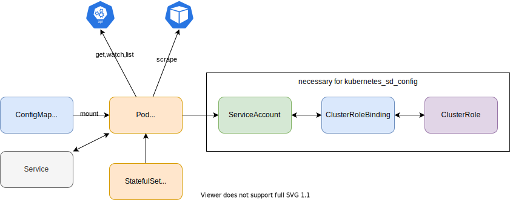
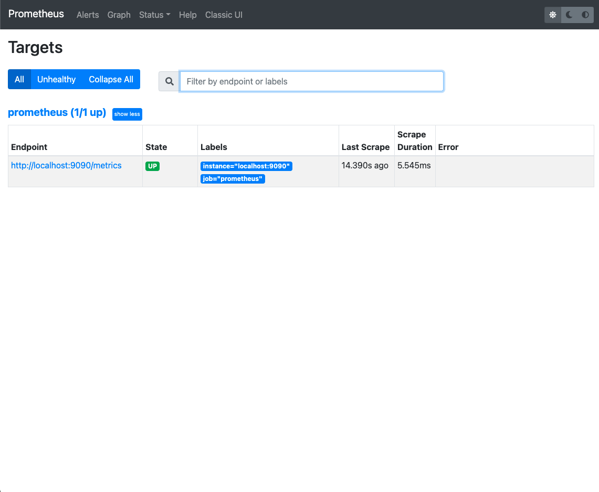

# Prometheus

## Diagram



## Deploy

1. Deploy Prometheus in `monitoring` namespace.

    ```
    kubectl create ns monitoring
    kubectl apply -k .
    ```
1. Check on browser.
    ```
    kubectl -n monitoring port-forward svc/prometheus 9090:9090
    ```
    Open http://localhost:9090

    1. You can see `prometheus (1/1 up)`.

        This is defined in `prometheus.yml`

        ```yaml
        scrape_configs:
          - job_name: 'prometheus'
            # metrics_path defaults to '/metrics'
            # scheme defaults to 'http'.
            static_configs:
              - targets: ['localhost:9090']
        ```

        
1. Update `prometheus.yml` with
    ```yaml
    global:
      scrape_interval:     15s
      evaluation_interval: 15s
    ```
