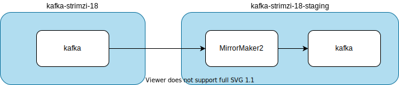
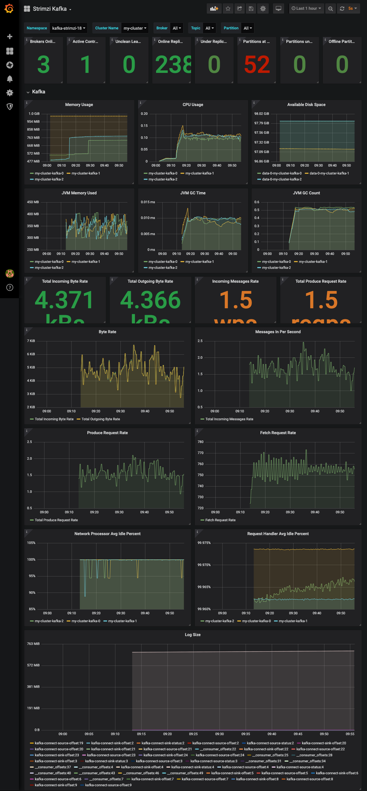

# Setup

https://strimzi.io/quickstarts/

## Versions

https://strimzi.io/docs/operators/in-development/full/deploying.html#ref-kafka-versions-str

|Kafka version|InterBroker protocol version|Log message format version|ZooKeeper version|
|---|---|---|---|
|2.7.0|2.7|2.7|3.5.8|
|2.7.1|2.7|2.7|3.5.9|
|2.8.0|2.8|2.8|3.5.9|

## Prepare new Strimzi version

Download `strimzi-x.xx.x.zip` from https://github.com/strimzi/strimzi-kafka-operator/releases

1. Put it under `cluster-operator/base` and unzip. (exclude `docs`)
2. Create `cluster-operator/base/strimzi-x.xx.x/kustomization.yaml`.
3. Create `cluster-operator/overlays/<younamespace>`.
4. Add `rolebinding` + `clusterrolebinding` to overwrite `namespace`.
    ```
    sed -i 's/namespace: .*/namespace: <yournamespace>/' cluster-operator/overlays/<yournamespace>/cluster-operator/*RoleBinding*.yaml
    ```


## Strimzi Operator

prepare strimzi operator

- `namespace`: `kafka`

```
kubectl apply -f namespace.yaml
kubectl apply -k cluster-operator/overlays/kafka
```

```
kubectl get po -n kafka
NAME                                       READY   STATUS    RESTARTS   AGE
strimzi-cluster-operator-6948f4dc6-br56b   1/1     Running   0          2m51s
```

## Kafka Cluster, KafkaTopic, and KafkaUser

- cluster name: `my-cluster`
- `namespace`: `kafka`

```
kubectl apply -k kafka-cluster
```
1. `namespace=kafka`
1. Check Kafka cluster

    ```
    NAME                                         READY   STATUS    RESTARTS   AGE
    my-cluster-entity-operator-b74545ccb-2rww6   3/3     Running   0          74s
    my-cluster-kafka-0                           1/1     Running   0          109s
    my-cluster-kafka-1                           1/1     Running   0          109s
    my-cluster-kafka-2                           1/1     Running   0          109s
    my-cluster-zookeeper-0                       1/1     Running   0          2m13s
    strimzi-cluster-operator-6948f4dc6-br56b     1/1     Running   0          8m45s
    ```

1. KafkaTopic

    Example: https://github.com/strimzi/strimzi-kafka-operator/blob/master/examples/topic/kafka-topic.yaml

    ```
    kubectl get KafkaTopic -n $namespace
    NAME                                                                                               CLUSTER      PARTITIONS   REPLICATION FACTOR   READY
    consumer-offsets---84e7a678d08f4bd226872e5cdd4eb527fadc1c6a                                        my-cluster   50           1                    True
    my-topic                                                                                           my-cluster   1            1                    True
    strimzi-store-topic---effb8e3e057afce1ecf67c3f5d8e4e3ff177fc55                                     my-cluster   1            3                    True
    strimzi-topic-operator-kstreams-topic-store-changelog---b75e702040b99be8a9263134de3507fc0cc4017b   my-cluster   1            1                    True
    ```

1. KafkaUser

    Example: https://github.com/strimzi/strimzi-kafka-operator/blob/master/examples/user/kafka-user.yaml

    ```
    kubectl get KafkaUser -n $namespace
    No resources found in kafka namespace.
    ```

## Test with console-producer & console-consumer

1. Set `namespace=kafka`

1. producer:

    ```bash
    kubectl -n $namespace run kafka-producer -ti --image=quay.io/strimzi/kafka:0.24.0-kafka-2.8.0 --rm=true --restart=Never -- bin/kafka-console-producer.sh --broker-list my-cluster-kafka-bootstrap:9092 --topic my-topic
    If you don't see a command prompt, try pressing enter.
    >test
    >test2
    >^Cpod "kafka-producer" deleted
    pod kafka/kafka-producer terminated (Error)
    ```

1. consumer:

    ```bash
    kubectl -n $namespace run kafka-consumer -ti --image=quay.io/strimzi/kafka:0.24.0-kafka-2.8.0 --rm=true --restart=Never -- bin/kafka-console-consumer.sh --bootstrap-server my-cluster-kafka-bootstrap:9092 --topic my-topic --from-beginning
    If you don't see a command prompt, try pressing enter.
    test
    test2
    ^CProcessed a total of 3 messages
    pod "kafka-consumer" deleted
    pod kafka/kafka-consumer terminated (Error)
    ```

## KafkaConnect

https://strimzi.io/docs/0.16.2/full.html#deploying-kafka-connect-str

```
  annotations:
    strimzi.io/use-connector-resources: "true" # to enable connector resource
```

[file source connector]https://docs.confluent.io/current/connect/filestream_connector.html

```
overlays/kafka-strimzi-18/connect/source/connect-source.yaml
verlays/kafka-strimzi-18/connect/source/my-source-connector.yaml
```

```
kubectl get KafkaConnect
NAME                   DESIRED REPLICAS
kafka-connect-source   2
```

```
kubectl get KafkaConnector
NAME                  AGE
my-source-connector   9m2s
```

Check the message

```
kubectl run kafka-consumer -ti --image=strimzi/kafka:0.18.0-kafka-2.5.0 --rm=true --restart=Never -- bin/kafka-console-consumer.sh --bootstrap-server my-cluster-kafka-bootstrap:9092 --topic my-topic --from-beginning

If you don't see a command prompt, try pressing enter.
OpenJDK 64-Bit Server VM warning: If the number of processors is expected to increase from one, then you should configure the number of parallel GC threads appropriately using -XX:ParallelGCThreads=N
""
"                                 Apache License"
"                           Version 2.0, January 2004"
"                        http://www.apache.org/licenses/"
""
"   TERMS AND CONDITIONS FOR USE, REPRODUCTION, AND DISTRIBUTION"
""
...
```

```
kubectl run kafka-consumer -ti --image=strimzi/kafka:0.18.0-kafka-2.5.0 --rm=true --restart=Never -- bin/kafka-console-consumer.sh --bootstrap-server my-cluster-kafka-bootstrap:9092 --topic twitter --from-beginning
{"schema":{"type":"struct","fields":[{"type":"int64","optional":false,"field":"id"},{"type":"string","optional":true,"field":"created_at"},{"type":"struct","fields":[{"type":"int64","optional":false,"field":"id"},{"type":"string","optional":true,"field":"name"},{"type":"string","optional":true,"field":"screen_name"},{"type":"string","optional":true,"field":"location"},{"type":"boolean","optional":false,"field":"verified"},{"type":"int32","optional":false,"field":"friends_count"},{"type":"int32","optional":false,"field":"followers_count"},{"type":"int32","optional":false,"field":"statuses_count"}],"optional":false,"name":"com.eneco.trading.kafka.connect.twitter.User","field":"user"},{"type":"string","optional":true,"field":"text"},{"type":"string","optional":true,"field":"lang"},{"type":"boolean","optional":false,"field":"is_retweet"},{"type":"struct","fields":[{"type":"array","items":{"type":"struct","fields":[{"type":"string","optional":true,"field":"text"}],"optional":false,"name":"com.eneco.trading.kafka.connect.twitter.Hashtag"},"optional":true,"field":"hashtags"},{"type":"array","items":{"type":"struct","fields":[{"type":"string","optional":true,"field":"display_url"},{"type":"string","optional":true,"field":"expanded_url"},{"type":"int64","optional":false,"field":"id"},{"type":"string","optional":true,"field":"type"},{"type":"string","optional":true,"field":"url"}],"optional":false,"name":"com.eneco.trading.kafka.connect.twitter.Medium"},"optional":true,"field":"media"},{"type":"array","items":{"type":"struct","fields":[{"type":"string","optional":true,"field":"display_url"},{"type":"string","optional":true,"field":"expanded_url"},{"type":"string","optional":true,"field":"url"}],"optional":false,"name":"com.eneco.trading.kafka.connect.twitter.Url"},"optional":true,"field":"urls"},{"type":"array","items":{"type":"struct","fields":[{"type":"int64","optional":false,"field":"id"},{"type":"string","optional":true,"field":"name"},{"type":"string","optional":true,"field":"screen_name"}],"optional":false,"name":"com.eneco.trading.kafka.connect.twitter.UserMention"},"optional":true,"field":"user_mentions"}],"optional":false,"name":"com.eneco.trading.kafka.connect.twitter.Entities","field":"entities"}],"optional":false,"name":"com.eneco.trading.kafka.connect.twitter.Tweet"},"payload":{"id":1290101985916592128,"created_at":"2020-08-03T01:47:37.000+0000","user":{"id":2901232483,"name":"Keryi\uD83E\uDD8B","screen_name":"keryikeryi","location":"Seattle, WA","verified":false,"friends_count":153,"followers_count":222,"statuses_count":13157},"text":"RT @LilNasX: corona is that nigga who already graduated but won’t stop coming up to the school","lang":"en","is_retweet":true,"entities":{"hashtags":[],"media":[],"urls":[],"user_mentions":[{"id":754006735468261376,"name":"nope","screen_name":"LilNasX"}]}}}
^CProcessed a total of 1056 messages
```

- https://docs.confluent.io/current/connect/kafka-connect-elasticsearch/configuration_options.html

# Enable the Cluster Operator to watch multiple namespaces

https://strimzi.io/docs/0.16.2/full.html#deploying-cluster-operator-to-watch-multiple-namespacesstr

## Change STRIMZI_NAMESPACE

TO update `STRIMZI_NAMESPACE`, add a patch yaml and include it in `kustomization.yaml` in `kafka-strimzi-18` (Reference: [Kustomize でマニフェストのフィールドを削除する](https://text.superbrothers.dev/200315-delete-field-with-kustomize/))

```yaml
apiVersion: apps/v1
kind: Deployment
metadata:
  name: strimzi-cluster-operator
spec:
  template:
    spec:
      serviceAccountName: strimzi-cluster-operator
      containers:
      - name: strimzi-cluster-operator
        env:
        - name: STRIMZI_NAMESPACE
          value: kafka-strimzi-18,kafka-strimzi-18-staging
          valueFrom: null
```

Diff

```
kubectl diff -k overlays/kafka-strimzi-18
-  generation: 1
+  generation: 2
   labels:
     app: strimzi
   name: strimzi-cluster-operator
@@ -36,10 +36,7 @@
         - /opt/strimzi/bin/cluster_operator_run.sh
         env:
         - name: STRIMZI_NAMESPACE
-          valueFrom:
-            fieldRef:
-              apiVersion: v1
-              fieldPath: metadata.namespace
+          value: kafka-strimzi-18,kafka-strimzi-18-staging
         - name: STRIMZI_FULL_RECONCILIATION_INTERVAL_MS
```

Apply

```
kubectl apply -k overlays/kafka-strimzi-18
customresourcedefinition.apiextensions.k8s.io/kafkabridges.kafka.strimzi.io unchanged
customresourcedefinition.apiextensions.k8s.io/kafkaconnectors.kafka.strimzi.io unchanged
customresourcedefinition.apiextensions.k8s.io/kafkaconnects.kafka.strimzi.io unchanged
customresourcedefinition.apiextensions.k8s.io/kafkaconnects2is.kafka.strimzi.io unchanged
customresourcedefinition.apiextensions.k8s.io/kafkamirrormaker2s.kafka.strimzi.io unchanged
customresourcedefinition.apiextensions.k8s.io/kafkamirrormakers.kafka.strimzi.io unchanged
customresourcedefinition.apiextensions.k8s.io/kafkarebalances.kafka.strimzi.io unchanged
customresourcedefinition.apiextensions.k8s.io/kafkas.kafka.strimzi.io unchanged
customresourcedefinition.apiextensions.k8s.io/kafkatopics.kafka.strimzi.io unchanged
customresourcedefinition.apiextensions.k8s.io/kafkausers.kafka.strimzi.io unchanged
serviceaccount/strimzi-cluster-operator unchanged
clusterrole.rbac.authorization.k8s.io/strimzi-cluster-operator-global unchanged
clusterrole.rbac.authorization.k8s.io/strimzi-cluster-operator-namespaced unchanged
clusterrole.rbac.authorization.k8s.io/strimzi-entity-operator unchanged
clusterrole.rbac.authorization.k8s.io/strimzi-kafka-broker unchanged
clusterrole.rbac.authorization.k8s.io/strimzi-topic-operator unchanged
rolebinding.rbac.authorization.k8s.io/strimzi-cluster-operator-entity-operator-delegation unchanged
rolebinding.rbac.authorization.k8s.io/strimzi-cluster-operator-topic-operator-delegation unchanged
rolebinding.rbac.authorization.k8s.io/strimzi-cluster-operator unchanged
clusterrolebinding.rbac.authorization.k8s.io/strimzi-cluster-operator-kafka-broker-delegation unchanged
clusterrolebinding.rbac.authorization.k8s.io/strimzi-cluster-operator unchanged
deployment.apps/strimzi-cluster-operator configured
kafka.kafka.strimzi.io/my-cluster unchanged
```

## RoleBinding & ClusterRoleBinding

Copy `RoleBinding` from `kafka-strimzi-18`

```
mkdir -p overlays/kafka-strimzi-18-staging/strimzi-0.18.0/install/cluster-operator
cp overlays/kafka-strimzi-18/strimzi-0.18.0/install/cluster-operator/*-RoleBinding*yaml overlays/kafka-strimzi-18-staging/strimzi-0.18.0/install/cluster-operator
```

Apply

```
kubectl apply -k overlays/kafka-strimzi-18-staging
rolebinding.rbac.authorization.k8s.io/strimzi-cluster-operator-entity-operator-delegation created
rolebinding.rbac.authorization.k8s.io/strimzi-cluster-operator-topic-operator-delegation created
rolebinding.rbac.authorization.k8s.io/strimzi-cluster-operator created
```

## Kafka Cluster

Prepare `my-cluster.yaml` and add it to `kustomization.yaml`

```
cp overlays/kafka-strimzi-18/my-cluster.yaml overlays/kafka-strimzi-18-staging
```

Apply

```
kubectl apply -k overlays/kafka-strimzi-18-staging
rolebinding.rbac.authorization.k8s.io/strimzi-cluster-operator-entity-operator-delegation unchanged
rolebinding.rbac.authorization.k8s.io/strimzi-cluster-operator-topic-operator-delegation unchanged
rolebinding.rbac.authorization.k8s.io/strimzi-cluster-operator unchanged
kafka.kafka.strimzi.io/my-cluster created
```

Check

```
kubectl get pod -n $namespace-staging
NAME                                         READY   STATUS    RESTARTS   AGE
my-cluster-entity-operator-fd45b849f-9vk62   3/3     Running   0          59s
my-cluster-kafka-0                           2/2     Running   0          2m23s
my-cluster-zookeeper-0                       1/1     Running   0          3m19s
```

## Kafka MirrorMaker

https://strimzi.io/docs/operators/master/using.html#assembly-deployment-configuration-kafka-mirror-maker-str

Prerequisite:

- Run multiple clusters

```
kubectl apply -k strimzi/overlays/kafka-strimzi-18-staging
```

```
kubectl get KafkaTopic -n kafka-strimzi-18-staging
NAME                                                          PARTITIONS   REPLICATION FACTOR
consumer-offsets---84e7a678d08f4bd226872e5cdd4eb527fadc1c6a   50           1
heartbeats                                                    1            1
mirrormaker2-cluster-configs                                  1            1
mirrormaker2-cluster-offsets                                  25           1
mirrormaker2-cluster-status                                   5            1
my-cluster-source.checkpoints.internal                        1            1
my-cluster-source.kafka-connect-sink-config                   1            1
my-cluster-source.kafka-connect-sink-offset                   25           1
my-cluster-source.kafka-connect-sink-status                   5            1
my-cluster-source.kafka-connect-source-config                 1            1
my-cluster-source.kafka-connect-source-offset                 25           1
my-cluster-source.kafka-connect-source-status                 5            1
my-cluster-source.my-topic                                    1            1
my-cluster-source.twitter                                     1            1
```



check

```
kubectl -n kafka-strimzi-18-staging run kafka-consumer -ti --image=strimzi/kafka:0.18.0-kafka-2.5.0 --rm=true --restart=Never -- bin/kafka-console-consumer.sh --bootstrap-server my-cluster-kafka-bootstrap:9092 --topic my-cluster-source.twitter

If you don't see a command prompt, try pressing enter.
{"schema":{"type":"struct","fields":[{"type":"int64","optional":false,"field":"id"},{"type":"string","optional":true,"field":"created_at"},{"type":"struct","fields":[{"type":"int64","optional":false,"field":"id"},{"type":"string","optional":true,"field":"name"},{"type":"string","optional":true,"field":"screen_name"},{"type":"string","optional":true,"field":"location"},{"type":"boolean","optional":false,"field":"verified"},{"type":"int32","optional":false,"field":"friends_count"},{"type":"int32","optional":false,"field":"followers_count"},{"type":"int32","optional":false,"field":"statuses_count"}],"optional":false,"name":"com.eneco.trading.kafka.connect.twitter.User","field":"user"},{"type":"string","optional":true,"field":"text"},{"type":"string","optional":true,"field":"lang"},{"type":"boolean","optional":false,"field":"is_retweet"},{"type":"struct","fields":[{"type":"array","items":{"type":"struct","fields":[{"type":"string","optional":true,"field":"text"}],"optional":false,"name":"com.eneco.trading.kafka.connect.twitter.Hashtag"},"optional":true,"field":"hashtags"},{"type":"array","items":{"type":"struct","fields":[{"type":"string","optional":true,"field":"display_url"},{"type":"string","optional":true,"field":"expanded_url"},{"type":"int64","optional":false,"field":"id"},{"type":"string","optional":true,"field":"type"},{"type":"string","optional":true,"field":"url"}],"optional":false,"name":"com.eneco.trading.kafka.connect.twitter.Medium"},"optional":true,"field":"media"},{"type":"array","items":{"type":"struct","fields":[{"type":"string","optional":true,"field":"display_url"},{"type":"string","optional":true,"field":"expanded_url"},{"type":"string","optional":true,"field":"url"}],"optional":false,"name":"com.eneco.trading.kafka.connect.twitter.Url"},"optional":true,"field":"urls"},{"type":"array","items":{"type":"struct","fields":[{"type":"int64","optional":false,"field":"id"},{"type":"string","optional":true,"field":"name"},{"type":"string","optional":true,"field":"screen_name"}],"optional":false,"name":"com.eneco.trading.kafka.connect.twitter.UserMention"},"optional":true,"field":"user_mentions"}],"optional":false,"name":"com.eneco.trading.kafka.connect.twitter.Entities","field":"entities"}],"optional":false,"name":"com.eneco.trading.kafka.connect.twitter.Tweet"},"payload":{"id":1293333835531329545,"created_at":"2020-08-11T23:49:50.000+0000","user":{"id":1129412194779766784,"name":"Mizibak \uD83C\uDDEC\uD83C\uDDE7","screen_name":"mizibak","location":null,"verified":false,"friends_count":1022,"followers_count":675,"statuses_count":25644},"text":"RT @NeuroNerd78: Take a strain of viruses that are abundant,Corona for example,say a new one has emerged, give it a name,apply a list of sy…","lang":"en","is_retweet":true,"entities":{"hashtags":[],"media":[],"urls":[],"user_mentions":[{"id":1182033581755031552,"name":"Angie \uD83D\uDC1DOverlord of the Wasps\uD83D\uDC1D","screen_name":"NeuroNerd78"}]}}}
{"schema":{"type":"struct","fields":[{"type":"int64","optional":false,"field":"id"},{"type":"string","optional":true,"field":"created_at"},{"type":"struct","fields":[{"type":"int64","optional":false,"field":"id"},{"type":"string","optional":true,"field":"name"},{"type":"string","optional":true,"field":"screen_name"},{"type":"string","optional":true,"field":"location"},{"type":"boolean","optional":false,"field":"verified"},{"type":"int32","optional":false,"field":"friends_count"},{"type":"int32","optional":false,"field":"followers_count"},{"type":"int32","optional":false,"field":"statuses_count"}],"optional":false,"name":"com.eneco.trading.kafka.connect.twitter.User","field":"user"},{"type":"string","optional":true,"field":"text"},{"type":"string","optional":true,"field":"lang"},{"type":"boolean","optional":false,"field":"is_retweet"},{"type":"struct","fields":[{"type":"array","items":{"type":"struct","fields":[{"type":"string","optional":true,"field":"text"}],"optional":false,"name":"com.eneco.trading.kafka.connect.twitter.Hashtag"},"optional":true,"field":"hashtags"},{"type":"array","items":{"type":"struct","fields":[{"type":"string","optional":true,"field":"display_url"},{"type":"string","optional":true,"field":"expanded_url"},{"type":"int64","optional":false,"field":"id"},{"type":"string","optional":true,"field":"type"},{"type":"string","optional":true,"field":"url"}],"optional":false,"name":"com.eneco.trading.kafka.connect.twitter.Medium"},"optional":true,"field":"media"},{"type":"array","items":{"type":"struct","fields":[{"type":"string","optional":true,"field":"display_url"},{"type":"string","optional":true,"field":"expanded_url"},{"type":"string","optional":true,"field":"url"}],"optional":false,"name":"com.eneco.trading.kafka.connect.twitter.Url"},"optional":true,"field":"urls"},{"type":"array","items":{"type":"struct","fields":[{"type":"int64","optional":false,"field":"id"},{"type":"string","optional":true,"field":"name"},{"type":"string","optional":true,"field":"screen_name"}],"optional":false,"name":"com.eneco.trading.kafka.connect.twitter.UserMention"},"optional":true,"field":"user_mentions"}],"optional":false,"name":"com.eneco.trading.kafka.connect.twitter.Entities","field":"entities"}],"optional":false,"name":"com.eneco.trading.kafka.connect.twitter.Tweet"},"payload":{"id":1293333835531329545,"created_at":"2020-08-11T23:49:50.000+0000","user":{"id":1129412194779766784,"name":"Mizibak \uD83C\uDDEC\uD83C\uDDE7","screen_name":"mizibak","location":null,"verified":false,"friends_count":1022,"followers_count":675,"statuses_count":25644},"text":"RT @NeuroNerd78: Take a strain of viruses that are abundant,Corona for example,say a new one has emerged, give it a name,apply a list of sy…","lang":"en","is_retweet":true,"entities":{"hashtags":[],"media":[],"urls":[],"user_mentions":[{"id":1182033581755031552,"name":"Angie \uD83D\uDC1DOverlord of the Wasps\uD83D\uDC1D","screen_name":"NeuroNerd78"}]}}}
^CProcessed a total of 2 messages
pod "kafka-consumer" deleted
pod kafka-strimzi-18-staging/kafka-consumer terminated (Error)
```

# Monitoring

- `KafkaExporter` in Kafka -> [kafka-exporter-configuration](https://strimzi.io/docs/operators/master/deploying.html#proc-kafka-exporter-configuring-str)
- `metrics` in `kafka` and `zookeeper` container -> [kafka-metrics.yaml](https://github.com/strimzi/strimzi-kafka-operator/blob/master/examples/metrics/kafka-metrics.yaml)
- [Deploying the CoreOS Prometheus Operator](https://strimzi.io/docs/operators/master/deploying.html#proc-metrics-deploying-prometheus-operator-str)

## Prometheus

1. Deploy operator

    ```
    git clone https://github.com/coreos/kube-prometheus && cd kube-prometheus
    kubectl apply -f manifests/setup
    ```

1. Deploy resources

    ```
    kubectl apply -f manifests
    ```

    <!-- `Prometheus` (the namespace Prometheus is going to be installed into)

    ```
    curl -s https://raw.githubusercontent.com/strimzi/strimzi-kafka-operator/master/examples/metrics/prometheus-install/prometheus.yaml | sed 's/namespace: .*/namespace: monitoring/' > strimzi/monitoring/prometheus.yaml
    ``` -->

1. Deploy `PodMonitor`

    Update namespace with the one where the pods to scrape the metrics from are running

    ```
    curl -s https://raw.githubusercontent.com/strimzi/strimzi-kafka-operator/master/examples/metrics/prometheus-install/strimzi-pod-monitor.yaml | sed 's/myproject/kafka-strimzi-18/' > strimzi/monitoring/strimzi-pod-monitor.yaml
    ```

    ```
    kubectl apply -f strimzi/monitoring/strimzi-pod-monitor.yaml -n monitoring
    ```

1. Deploy `PrometheusRule` and `prometheus-additonal-config` (TBD)
    ```
    curl -s https://raw.githubusercontent.com/strimzi/strimzi-kafka-operator/master/examples/metrics/prometheus-install/prometheus-rules.yaml > strimzi/monitoring/prometheus-rules.yaml
    ```

    ```
    curl -s https://raw.githubusercontent.com/strimzi/strimzi-kafka-operator/master/examples/metrics/prometheus-additional-properties/prometheus-additional.yaml > strimzi/monitoring/prometheus-additional.yaml
    kubectl create secret generic additional-scrape-configs --from-file=strimzi/monitoring/prometheus-additional.yaml -n monitoring
    ```

    ```
    # kubectl apply -f strimzi/monitoring/prometheus-rules.yaml -n monitoring
    # kubectl apply -f strimzi/monitoring/prometheus.yaml -n monitoring
    ```

1. Add the `podMonitorSelector` to `Prometheus` by `kubectl edit Prometheus -n monitoring`

    ```
      podMonitorSelector:
        matchLabels:
          app: strimzi
    ```

1. Update service account `prometheus-k8s` to add the followings:

    ```
    kubectl edit clusterrole prometheus-k8s -o yaml
    ```

    ```
      - apiGroups: [""]
        resources:
          - nodes
          - nodes/proxy
          - services
          - endpoints
          - pods
        verbs: ["get", "list", "watch"]
      - apiGroups:
          - extensions
        resources:
          - ingresses
        verbs: ["get", "list", "watch"]
      - nonResourceURLs: ["/metrics"]
        verbs: ["get"]
    ```

## Alertmanager (TBD)

```
curl -s https://raw.githubusercontent.com/strimzi/strimzi-kafka-operator/master/examples/metrics/prometheus-install/alert-manager.yaml > strimzi/monitoring/alert-manager.yaml
curl -s https://raw.githubusercontent.com/strimzi/strimzi-kafka-operator/master/examples/metrics/prometheus-alertmanager-config/alert-manager-config.yaml > strimzi/monitoring/alert-manager-config.yaml
```

Change `slack_api_url`

```
kubectl create secret generic alertmanager-alertmanager --from-file=alertmanager.yaml=strimzi/monitoring/alert-manager-config.yaml -n monitoring
```

```
kubectl apply -f strimzi/monitoring/alert-manager.yaml -n monitoring
```

## Grafana

Import [dashoboard](https://github.com/strimzi/strimzi-kafka-operator/tree/master/examples/metrics/grafana-dashboards)



# Authentication & Authorization

[Listerner authentication](https://strimzi.io/docs/operators/master/using.html#assembly-kafka-broker-listener-authentication-deployment-configuration-kafka)

- Mutual TLS authentication
    - The client supports authenticaton using mutual TLS authentication
    - It is necessary to ue the TLS certificates rather than passwords
    - You can reconfigure and restart client applications periodically so that they do not use expired certificates
- SCRAM-SHA(Salted Challenge Response Authenticatoin Mechanism) authentication
    - Support `SCRAM-SHA-512` only.
    - The client supports authentication using SCRAM-SHA-512
    - It is necessary to use passwords rather than the TLS certificates
    - Authentication for unencrypted communication is required
- no `authentication` property -> not authenticate

# debug

## KafkaConnector fails to join group

```
2020-08-02 02:54:06,347 INFO [Worker clientId=connect-1, groupId=kafka-connect-source] Join group failed with org.apache.kafka.common.errors.MemberIdRequiredException: The group member needs to have a valid member id before actually entering a consumer group (org.apache.kafka.clients.consumer.internals.AbstractCoordinator) [DistributedHerder-connect-1-1]
```

Connector was old.

## KafkaConnector Elasticsearch fails


```
 "java.lang.NoClassDefFoundError: com/google/common/collect/ImmutableSet\n\tat
        io.searchbox.client.AbstractJestClient.<init>(AbstractJestClient.java:38)\n\tat
        io.searchbox.client.http.JestHttpClient.<init>(JestHttpClient.java:43)\n\tat
        io.searchbox.client.JestClientFactory.getObject(JestClientFactory.java:51)\n\tat
        io.confluent.connect.elasticsearch.jest.JestElasticsearchClient.<init>(JestElasticsearchClient.java:150)\n\tat
        io.confluent.connect.elasticsearch.jest.JestElasticsearchClient.<init>(JestElasticsearchClient.java:142)\n\tat
        io.confluent.connect.elasticsearch.ElasticsearchSinkTask.start(ElasticsearchSinkTask.java:122)\n\tat
        io.confluent.connect.elasticsearch.ElasticsearchSinkTask.start(ElasticsearchSinkTask.java:51)\n\tat
        org.apache.kafka.connect.runtime.WorkerSinkTask.initializeAndStart(WorkerSinkTask.java:305)\n\tat
        org.apache.kafka.connect.runtime.WorkerSinkTask.execute(WorkerSinkTask.java:193)\n\tat
        org.apache.kafka.connect.runtime.WorkerTask.doRun(WorkerTask.java:184)\n\tat
        org.apache.kafka.connect.runtime.WorkerTask.run(WorkerTask.java:234)\n\tat
        java.util.concurrent.Executors$RunnableAdapter.call(Executors.java:511)\n\tat
        java.util.concurrent.FutureTask.run(FutureTask.java:266)\n\tat java.util.concurrent.ThreadPoolExecutor.runWorker(ThreadPoolExecutor.java:1149)\n\tat
        java.util.concurrent.ThreadPoolExecutor$Worker.run(ThreadPoolExecutor.java:624)\n\tat
        java.lang.Thread.run(Thread.java:748)\nCaused by: java.lang.ClassNotFoundException:
        com.google.common.collect.ImmutableSet\n\tat java.net.URLClassLoader.findClass(URLClassLoader.java:382)\n\tat
        java.lang.ClassLoader.loadClass(ClassLoader.java:418)\n\tat org.apache.kafka.connect.runtime.isolation.PluginClassLoader.loadClass(PluginClassLoader.java:104)\n\tat
        java.lang.ClassLoader.loadClass(ClassLoader.java:351)\n\t... 16 more\n"
```

Need to add gua


## Kafka Connect Elasticsearch fails

```
org.apache.kafka.connect.errors.ConnectException: Couldn't start ElasticsearchSinkTask due to connection error:
        at io.confluent.connect.elasticsearch.jest.JestElasticsearchClient.<init>(JestElasticsearchClient.java:159)
        at io.confluent.connect.elasticsearch.jest.JestElasticsearchClient.<init>(JestElasticsearchClient.java:142)
        at io.confluent.connect.elasticsearch.ElasticsearchSinkTask.start(ElasticsearchSinkTask.java:122)
        at io.confluent.connect.elasticsearch.ElasticsearchSinkTask.start(ElasticsearchSinkTask.java:51)
        at org.apache.kafka.connect.runtime.WorkerSinkTask.initializeAndStart(WorkerSinkTask.java:305)
        at org.apache.kafka.connect.runtime.WorkerSinkTask.execute(WorkerSinkTask.java:193)
        at org.apache.kafka.connect.runtime.WorkerTask.doRun(WorkerTask.java:184)
        at org.apache.kafka.connect.runtime.WorkerTask.run(WorkerTask.java:234)
        at java.util.concurrent.Executors.call(Executors.java:511)
        at java.util.concurrent.FutureTask.run(FutureTask.java:266)
        at java.util.concurrent.ThreadPoolExecutor.runWorker(ThreadPoolExecutor.java:1149)
        at java.util.concurrent.ThreadPoolExecutor.run(ThreadPoolExecutor.java:624)
        at java.lang.Thread.run(Thread.java:748)
Caused by: javax.net.ssl.SSLHandshakeException: sun.security.validator.ValidatorException: PKIX path building failed: sun.security.provider.certpath.SunCertPathBuilderException: unable to find valid certification path to requested target
        at sun.security.ssl.Alerts.getSSLException(Alerts.java:198)
        at sun.security.ssl.SSLSocketImpl.fatal(SSLSocketImpl.java:1967)
        at sun.security.ssl.Handshaker.fatalSE(Handshaker.java:331)
        at sun.security.ssl.Handshaker.fatalSE(Handshaker.java:325)
        at sun.security.ssl.ClientHandshaker.serverCertificate(ClientHandshaker.java:1688)
        at sun.security.ssl.ClientHandshaker.processMessage(ClientHandshaker.java:226)
        at sun.security.ssl.Handshaker.processLoop(Handshaker.java:1082)
        at sun.security.ssl.Handshaker.process_record(Handshaker.java:1010)
        at sun.security.ssl.SSLSocketImpl.readRecord(SSLSocketImpl.java:1079)
        at sun.security.ssl.SSLSocketImpl.performInitialHandshake(SSLSocketImpl.java:1388)
        at sun.security.ssl.SSLSocketImpl.startHandshake(SSLSocketImpl.java:1416)
        at sun.security.ssl.SSLSocketImpl.startHandshake(SSLSocketImpl.java:1400)
        at org.apache.http.conn.ssl.SSLConnectionSocketFactory.createLayeredSocket(SSLConnectionSocketFactory.java:396)
        at org.apache.http.conn.ssl.SSLConnectionSocketFactory.connectSocket(SSLConnectionSocketFactory.java:355)
        at org.apache.http.impl.conn.DefaultHttpClientConnectionOperator.connect(DefaultHttpClientConnectionOperator.java:142)
        at org.apache.http.impl.conn.PoolingHttpClientConnectionManager.connect(PoolingHttpClientConnectionManager.java:359)
        at org.apache.http.impl.execchain.MainClientExec.establishRoute(MainClientExec.java:381)
        at org.apache.http.impl.execchain.MainClientExec.execute(MainClientExec.java:237)
        at org.apache.http.impl.execchain.ProtocolExec.execute(ProtocolExec.java:185)
        at org.apache.http.impl.execchain.RetryExec.execute(RetryExec.java:89)
        at org.apache.http.impl.execchain.RedirectExec.execute(RedirectExec.java:111)
        at org.apache.http.impl.client.InternalHttpClient.doExecute(InternalHttpClient.java:185)
        at org.apache.http.impl.client.CloseableHttpClient.execute(CloseableHttpClient.java:83)
        at io.searchbox.client.http.JestHttpClient.executeRequest(JestHttpClient.java:133)
        at io.searchbox.client.http.JestHttpClient.execute(JestHttpClient.java:70)
        at io.searchbox.client.http.JestHttpClient.execute(JestHttpClient.java:63)
        at io.confluent.connect.elasticsearch.jest.JestElasticsearchClient.getServerVersion(JestElasticsearchClient.java:247)
        at io.confluent.connect.elasticsearch.jest.JestElasticsearchClient.<init>(JestElasticsearchClient.java:151)
        ... 12 more
Caused by: sun.security.validator.ValidatorException: PKIX path building failed: sun.security.provider.certpath.SunCertPathBuilderException: unable to find valid certification path to requested target
        at sun.security.validator.PKIXValidator.doBuild(PKIXValidator.java:450)
        at sun.security.validator.PKIXValidator.engineValidate(PKIXValidator.java:317)
        at sun.security.validator.Validator.validate(Validator.java:262)
        at sun.security.ssl.X509TrustManagerImpl.validate(X509TrustManagerImpl.java:330)
        at sun.security.ssl.X509TrustManagerImpl.checkTrusted(X509TrustManagerImpl.java:237)
        at sun.security.ssl.X509TrustManagerImpl.checkServerTrusted(X509TrustManagerImpl.java:132)
        at sun.security.ssl.ClientHandshaker.serverCertificate(ClientHandshaker.java:1670)
        ... 35 more
Caused by: sun.security.provider.certpath.SunCertPathBuilderException: unable to find valid certification path to requested target
        at sun.security.provider.certpath.SunCertPathBuilder.build(SunCertPathBuilder.java:141)
        at sun.security.provider.certpath.SunCertPathBuilder.engineBuild(SunCertPathBuilder.java:126)
        at java.security.cert.CertPathBuilder.build(CertPathBuilder.java:280)
        at sun.security.validator.PKIXValidator.doBuild(PKIXValidator.java:445)
        ... 41 more

```

# reference

- Custom image for KafkaConnect: https://strimzi.io/docs/operators/0.18.0/using.html#creating-new-image-from-base-str
- https://github.com/nakamasato/kafka-connect
